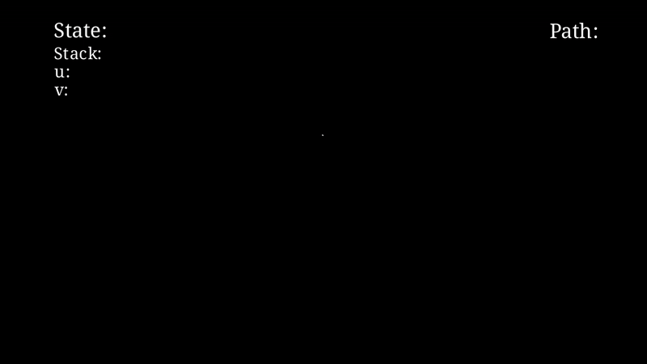

# Depth‑First Search (DFS)
Finished :sunglasses:
{: .label .label-red }

## What is DFS? :thinking:


Depth‑First Search (DFS) is a graph‑traversal algorithm that explores as far as possible along each branch before backtracking.

### Algorithm (pseudocode) :grin:

So the key idea is last in first out (LIFO)

```julia

DFS(G, s):
    create an empty stack S
    mark s as visited and push s  ➜  S ← [s]
    while S is not empty:
        u ← pop(S)
        for each neighbour v of u in reverse‑sorted(G.neighbours(u)):
            if v is unvisited:
                mark v as visited
                push v  ➜  S ← S ∪ {v}
```

**Time complexity**: $$\mathcal{O}(|\mathcal{V}|+|\mathcal{E}|)$$
**Space complexity**: $$\mathcal{O}(|\mathcal{V}|)$$ (It uses a queue to keep track of the vertices that need to be visited.)
**Usage** - cycle detection, topological sort, articulation points, maze generation, etc.

## Visualization :look:
The animation below is generated with Manim. It shows DFS expanding a queue and colouring vertices/edges in the order they are discovered.

<div align="center">

</div>

[Check Source Code for Visualization](../code/DFS_visualization.html)