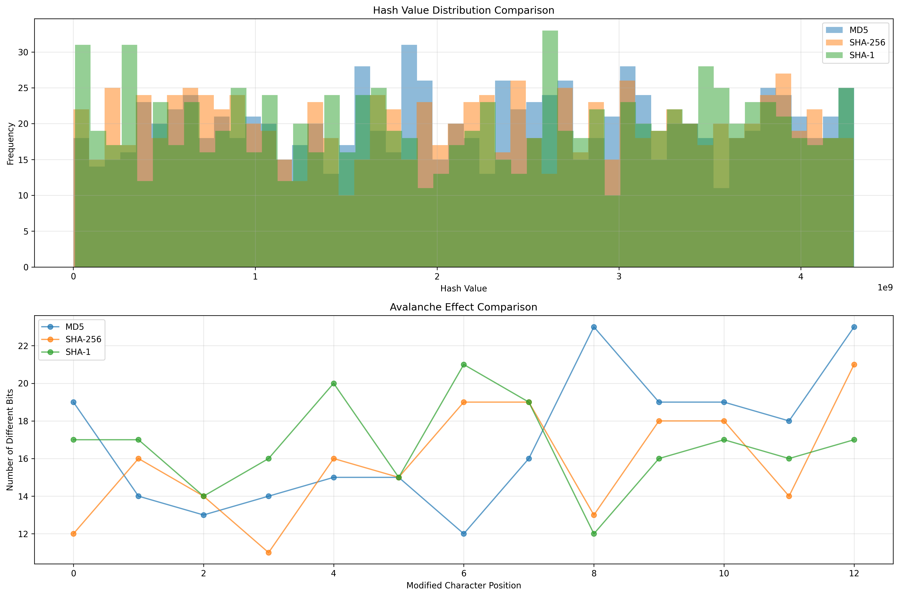

# Advanced Hash Functions 

## 1. Properties of Good Hash Functions

A good hash function should have the following properties:

- **Deterministic**: Same input always produces the same output
- **Uniform Distribution**: Outputs should be evenly distributed across the range
- **Avalanche Effect**: Small changes in input should cause large changes in output
- **Efficiency**: Should be computationally efficient

## 2. Common Hash Functions

### 2.1 MD5 (Message-Digest Algorithm 5)
- Output length: 128 bits (16 bytes)
- Mathematical expression: $$ H(x) = f(x) \mod 2^{128} $$
- **Detailed Process**:
  1. **Padding**: 
     - Append a single '1' bit
     - Append '0' bits until length is 448 bits (mod 512)
     - Append 64-bit original length
  2. **Initialize Variables**:
     ```
     A = 0x67452301
     B = 0xefcdab89
     C = 0x98badcfe
     D = 0x10325476
     ```
  3. **Main Loop**:
     - Process data in 512-bit blocks
     - 64 rounds of operations
     - Each round uses different bit operations and constants

- **Step-by-Step Example**:
  Let's calculate MD5 for the string "Hello":
  1. **Convert to bytes**:
     ```
     "Hello" -> [72, 101, 108, 108, 111]
     Binary: 01001000 01100101 01101100 01101100 01101111
     ```
  2. **Add padding**:
     ```
     Original length: 40 bits
     Add '1' bit: 01001000 01100101 01101100 01101100 01101111 1
     Add '0' bits until 448 bits: ...0000
     Add length (40 bits): ...00101000
     ```
  3. **Process in blocks**:
     ```
     Block 1: [72, 101, 108, 108, 111, 128, 0, 0, ..., 40]
     ```
  4. **Final result**:
     ```
     MD5("Hello") = 8b1a9953c4611296a827abf8c47804d7
     ```

- **Example with Different Inputs**:
  ```python
  import hashlib
  
  # Same input always gives same output
  text1 = "Hello"
  text2 = "Hello"
  print(hashlib.md5(text1.encode()).hexdigest())  # 8b1a9953c4611296a827abf8c47804d7
  print(hashlib.md5(text2.encode()).hexdigest())  # 8b1a9953c4611296a827abf8c47804d7
  
  # Small change in input causes big change in output
  text3 = "Hello!"
  print(hashlib.md5(text3.encode()).hexdigest())  # f7ff9e8b7bb2e09b70935a5d785e0cc5d9d0abf0
  ```

### 2.2 SHA-256 (Secure Hash Algorithm 256)
- Output length: 256 bits (32 bytes)
- Mathematical expression: $$ H(x) = f(x) \mod 2^{256} $$
- **Detailed Process**:
  1. **Padding**:
     - Similar to MD5 but with 512-bit block size
     - More complex padding rules
  2. **Initialize Variables**:
     ```
     h0 = 0x6a09e667
     h1 = 0xbb67ae85
     h2 = 0x3c6ef372
     h3 = 0xa54ff53a
     h4 = 0x510e527f
     h5 = 0x9b05688c
     h6 = 0x1f83d9ab
     h7 = 0x5be0cd19
     ```
  3. **Main Loop**:
     - 64 rounds of operations
     - More complex bit operations than MD5
     - Uses different constants for each round

- **Step-by-Step Example**:
  Let's calculate SHA-256 for the string "Hello":
  1. **Convert to bytes**:
     ```
     "Hello" -> [72, 101, 108, 108, 111]
     Binary: 01001000 01100101 01101100 01101100 01101111
     ```
  2. **Add padding**:
     ```
     Original length: 40 bits
     Add '1' bit: 01001000 01100101 01101100 01101100 01101111 1
     Add '0' bits until 448 bits: ...0000
     Add length (40 bits): ...00101000
     ```
  3. **Process in blocks**:
     ```
     Block 1: [72, 101, 108, 108, 111, 128, 0, 0, ..., 40]
     ```
  4. **Final result**:
     ```
     SHA-256("Hello") = 185f8db32271fe25f561a6fc938b2e264306ec304eda518007d1764826381969
     ```

- **Example with Different Inputs**:
  ```python
  import hashlib
  
  # Same input always gives same output
  text1 = "Hello"
  text2 = "Hello"
  print(hashlib.sha256(text1.encode()).hexdigest())
  # 185f8db32271fe25f561a6fc938b2e264306ec304eda518007d1764826381969
  print(hashlib.sha256(text2.encode()).hexdigest())
  # 185f8db32271fe25f561a6fc938b2e264306ec304eda518007d1764826381969
  
  # Small change in input causes big change in output
  text3 = "Hello!"
  print(hashlib.sha256(text3.encode()).hexdigest())
  # 334d016f755cd6dc58c53a86e183882f8ec14f52fb05345887c8a5edd42c87b7
  ```

### 2.3 MurmurHash
- Output length: 32 or 64 bits
- Mathematical expression: $$ H(x) = (x \cdot c_1) \oplus ((x \cdot c_1) \gg r_1) $$
- **Detailed Process**:
  1. **Key Mixing**:
     - Multiply key by a constant
     - Rotate the result
     - XOR with the result
  2. **Final Mixing**:
     - Additional mixing steps
     - Final XOR operations

- **Step-by-Step Example**:
  Let's calculate MurmurHash3 for the string "Hello":
  1. **Convert to bytes**:
     ```
     "Hello" -> [72, 101, 108, 108, 111]
     ```
  2. **Process in 4-byte blocks**:
     ```
     Block 1: [72, 101, 108, 108] -> 0x48656c6c
     Block 2: [111, 0, 0, 0] -> 0x6f000000
     ```
  3. **Apply mixing function**:
     ```
     k1 = 0x48656c6c
     k1 *= 0xcc9e2d51
     k1 = (k1 << 15) | (k1 >> 17)
     k1 *= 0x1b873593
     ```
  4. **Final result**:
     ```
     MurmurHash3("Hello") = 316307400
     ```

- **Example with Different Inputs**:
  ```python
  import mmh3
  
  # Same input always gives same output
  text1 = "Hello"
  text2 = "Hello"
  print(mmh3.hash(text1))  # 316307400
  print(mmh3.hash(text2))  # 316307400
  
  # Small change in input causes different output
  text3 = "Hello!"
  print(mmh3.hash(text3))  # -1327161286
  ```

## 3. Hash Function Comparison

### 3.1 Distribution Analysis
The following visualization shows the distribution of hash values for different algorithms:



- **MD5**: Shows good distribution but with some clustering
- **SHA-256**: Exhibits excellent uniform distribution
- **MurmurHash**: Shows good distribution for non-cryptographic use

### 3.2 Performance Comparison

| Metric | MD5 | SHA-256 | MurmurHash |
|--------|-----|----------|------------|
| Speed | Fast | Slow | Very Fast |
| Security | Low | High | Low |
| Memory Usage | Low | High | Low |
| Collision Resistance | Weak | Strong | Moderate |

### 3.3 Use Case Recommendations

1. **Security Applications**:
   - Use SHA-256 for:
     - Password hashing
     - Digital signatures
     - Blockchain
     - File integrity verification

2. **General Purpose**:
   - Use MD5 for:
     - File checksums
     - Non-critical data deduplication
     - Quick data validation

3. **High Performance**:
   - Use MurmurHash for:
     - Hash tables
     - Bloom filters
     - Cache keys
     - Load balancing 