# Hash Table

A hash table is an efficient data structure that maps keys to storage locations through a hash function, enabling fast data lookup, insertion, and deletion operations.

## Prelimary:

### Array vs Hash Table

Example: if we want to have an array that records how manu times each word apperas:

- **Array Limitation:**

  | Index | Value |
  |-------|---------|
  | 0 | hello |
  | 1 | and |
  | 2 | hello |
  | 3 | bye |
  | 4 | hello |

  In a standard array, you can only use integers as indices. For example:
  ```java
  String[] words = new String[5];
  words[0] = "hello";
  words[1] = "and";
  words[4] = "bye";
  ```
  This stores the words, but:
  - You don't know where a particular word (like "hello") is stored without searching the whole array.
  - You can't use a string directly as an index to get the word count.

- **The Ideal:**
  What if you could use any data type (like a string) as an index?
  ```java
  words["hello"] = 0;
  words["and"] = 0;
  ```
  This is not possible with a standard Java array.

- **The Hash Table Solution:**
  
  | Key  | Count |
  |------|-------|
  | hello| 3 |
  | and | 1 |
  | bye | 1 |

  We can use a **hash function** to map any data type (e.g., a string) to an integer index:
  ```java
  public int h(String key) { ... }
  words[h("hello")] = 0;
  words[h("and")] = 0;
  ```
  - Now, you can efficiently store and retrieve counts (or any value) for any string, without searching the whole array.

| Feature         | Array (Java)         | Hash Table (with h())         |
|-----------------|---------------------|-------------------------------|
| Index type      | Integer only        | Any data type (via hash)      |
| Direct lookup   | Yes (by int index)  | Yes (by key, via hash)        |
| Need to search? | Yes (for non-int)   | No (efficient lookup)         |
| Example         | `words[0]`          | `words[h("hello")]`           |


## 1. Basic Concepts

### 1.1 What is a Hash Table?
Formal Definition
A hash table is a data structure that implements an associative array, mapping keys to values, using a hash function.

Let
- $$ HT $$ be a table (array) of size $$ n $$
- $$ K $$ be the set of possible keys
- $$ V $$ be the set of possible values

A hash table is a mapping:
$$
HT: K \rightarrow V
$$
implemented as an array of size $$ n $$, together with a hash function
$$
h: K \rightarrow \{0, 1, ..., n-1\}
$$
such that for each key $$ k \in K $$, the value $$ v $$ (called a **record**) is stored at index $$ h(k) $$ in the table:
$$
HT[h(k)] = v
$$

Requirements for the hash function $$ h $$:
$$ h $$ should be efficient to compute (no table search).
- Ideally, for any two different keys $$ k_1 \neq k_2 $$, $$ h(k_1) \neq h(k_2) $$ (i.e., no collisions).
- In practice, collisions may occur, so collision resolution strategies are needed.
  
Example:

If $$ h(\text{"hello"}) = 3 $$ and $$ h(\text{"bye"}) = 3 $$, then inserting both would cause a collision at index 3, and one value would override the other unless handled properly.

In another word:

A hash table is like an intelligent library system:
- Each book (data) has a unique number (key)
- The librarian (hash function) quickly finds the storage location based on the number
- The bookshelf (array) stores the actual books

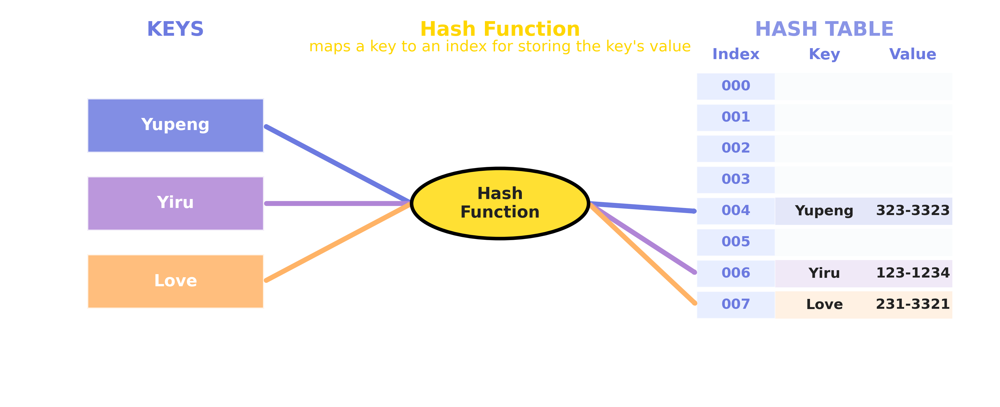

### 1.2 Core Components

1. **Key**: Unique identifier used for lookup
2. **Value**: Actual stored data
3. **Hash Function**: Function that converts keys to array indices
4. **Array**: Container for storing data

## 2. Working Principle

### 2.1 Hash Function 

A hash function converts input of arbitrary size to a fixed-size output (usually an integer). For example: 

```python
# Python Implementation
# Returns the raw sum (not suitable for real hash tables)
def simple_hash(key):
    return sum(ord(c) for c in str(key))
```

```java
// Java Implementation
// Returns the raw sum (not suitable for real hash tables)
public static int simpleHash(Object key ) {
    String strKey = key.toString();
    int sum = 0;
    for (int i = 0; i < strKey.length(); i++) {
        sum += (int) strKey.charAt(i);
    }
    return sum;
}
```

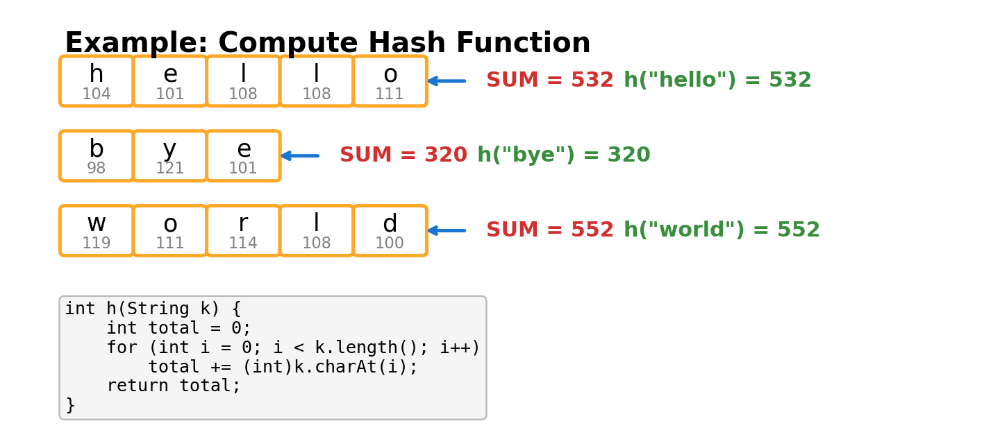

**Problem:**
The hash value can be very large, so the array would need to be huge to avoid collisions. To fit the hash value into a table of fixed size, we use the mod operation:

```python
# Python Implementation
# Returns the index in the table (0 <= index < size)
def simple_hash(key, size):
    return sum(ord(c) for c in str(key)) % size
```

```java
// Java Implementation
// Returns the index in the table (0 <= index < size)
public static int simpleHash(Object key, int size) {
    String strKey = key.toString();
    int sum = 0;
    for (int i = 0; i < strKey.length(); i++) {
        sum += (int) strKey.charAt(i);
    }
    return sum % size;
}
```

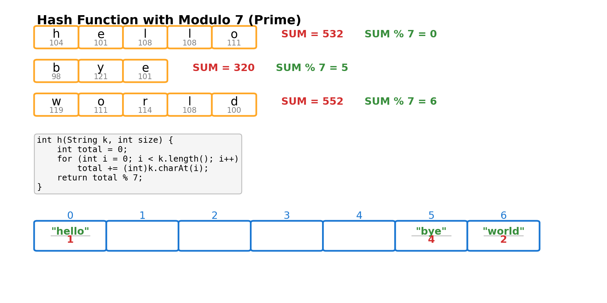

> **Why Use a Large Prime Number for Hash Table Size?**
>
> Choosing a large prime number as the hash table size helps ensure a more uniform distribution of hash values, reducing collisions. If the table size is a composite number (especially one related to patterns in the hash function, such as 2, 4, 8, etc.), it can lead to clustering, where different keys map to the same slot. For example, if the table size is 8 (a non-prime), and the hash function often produces even numbers, only half of the slots will be used, wasting space and increasing the probability of collisions. Using a large prime number as the table size breaks these patterns, making the distribution of keys more random and uniform, thereby improving the performance of the hash table.

Here are some advance usage of the hash function [Advanced Hash Function](Hash_Function.html).

### 2.2 Storage Process

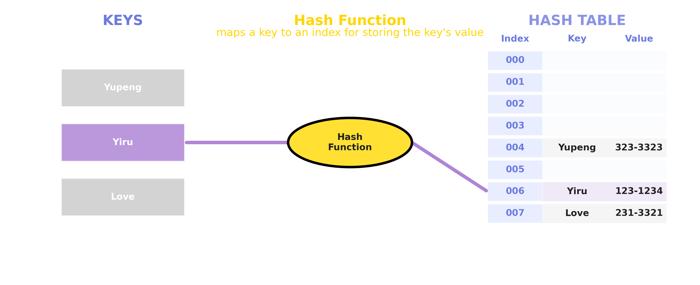

### 2.3 Search Process

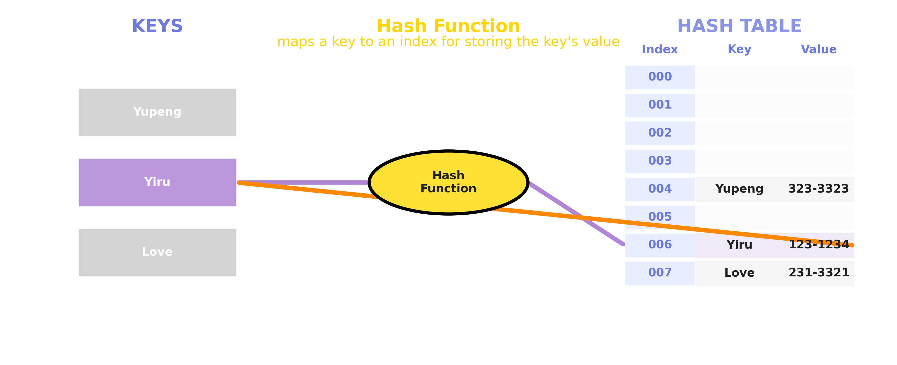


## 3. Collision Handling

### 3.1 What is a Hash Collision?

A collision occurs when two different keys map to the same index through the hash function.

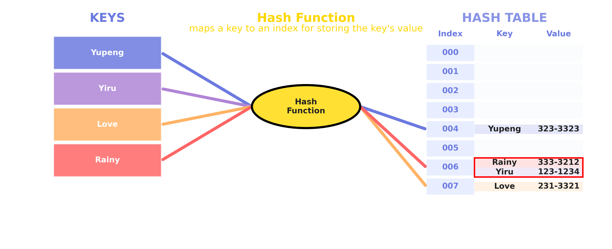

### 3.2 Methods to Handle Collisions

1. **Open Hashing**
   - Uses linked lists to store colliding elements
   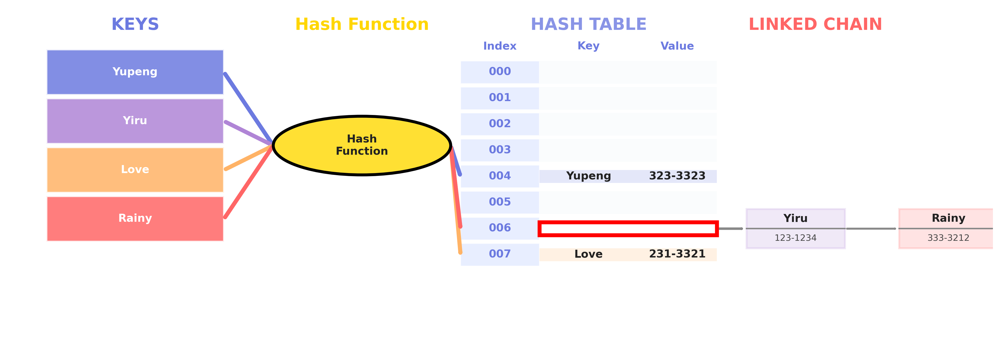

2. **Closed Hashing**
   - Linear Probing
   - Quadratic Probing
   - Double Hashing

#### Linear Probing Visualization

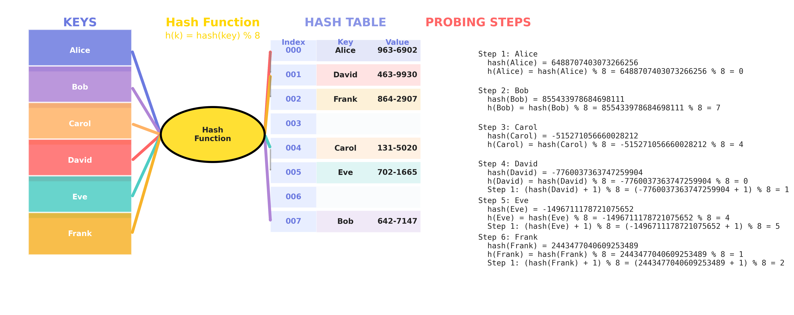

#### What is Linear Probing?

Linear probing is a collision resolution technique in closed hashing (open addressing).
When a collision occurs (i.e., the slot `hash(key) % size` is already occupied), linear probing checks the next slot in sequence:
- `(hash(key) + 1) % size`
- `(hash(key) + 2) % size`
- ...
until an empty slot is found.

**Example:**
Suppose `hash('Alice') = 123456789`, table size `S = 8`
- First try: `123456789 % 8 = 5`
- If slot 5 is full, try `(123456789 + 1) % 8 = 6`
- If slot 6 is full, try `(123456789 + 2) % 8 = 7`
- ... and so on.

#### Quadratic Probing Visualization

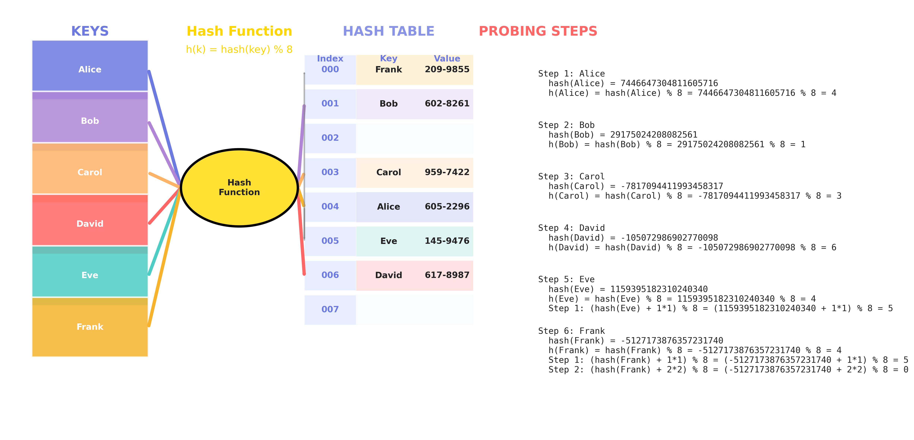

#### What is Quadratic Probing?

Quadratic probing is a collision resolution technique in closed hashing (open addressing).
When a collision occurs (i.e., the slot `hash(key) % size` is already occupied), quadratic probing checks the next slot in sequence:
- `(hash(key) + 1*1) % size`
- `(hash(key) + 2*2) % size`
- `(hash(key) + 3*3) % size`
- ...
until an empty slot is found.

**Example:**
Suppose `hash('Alice') = 123456789`, table size `S = 8`
- First try: `123456789 % 8 = 5`
- If slot 5 is full, try `(123456789 + 1*1) % 8 = 6`
- If slot 6 is full, try `(123456789 + 2*2) % 8 = 1`
- If slot 1 is full, try `(123456789 + 3*3) % 8 = 2`
- ... and so on.

#### Double Hashing

#### Double Hashing Visualization

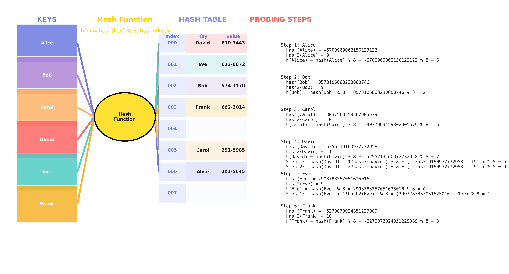

#### What is Double Hashing?

Double hashing is a collision resolution technique in closed hashing (open addressing).
When a collision occurs (i.e., the slot `hash(key) % size` is already occupied), double hashing checks the next slot in sequence:
- `(hash(key) + 1*hash2(key)) % size`
- `(hash(key) + 2*hash2(key)) % size`
- `(hash(key) + 3*hash2(key)) % size`
- ...
until an empty slot is found.

Here, `hash2(key)` is a second hash function that must return a value coprime with the table size.

**Example:**
Suppose `hash('Alice') = 123456789`, `hash2('Alice') = 5`, table size `S = 8`
- First try: `123456789 % 8 = 5`
- If slot 5 is full, try `(123456789 + 1*5) % 8 = 6`
- If slot 6 is full, try `(123456789 + 2*5) % 8 = 3`
- If slot 3 is full, try `(123456789 + 3*5) % 8 = 0`
- ... and so on.

### Comparison of Closed Hashing Methods

| Feature                | Linear Probing                                   | Quadratic Probing                                 | Double Hashing                                   |
|------------------------|--------------------------------------------------|---------------------------------------------------|--------------------------------------------------|
| **Probe Sequence**     | `(hash(x) + i) % S`                              | `(hash(x) + i*i) % S`                             | `(hash(x) + i*hash2(x)) % S`                     |
| **Cache Performance**  | Best (slots are contiguous in memory)            | Medium (slots are more spaced out)                | Poor (slots are scattered)                       |
| **Clustering**         | Suffers from primary clustering                  | Reduces primary, but can have secondary clustering| No clustering (if hash2 and S are coprime)       |
| **Computation Cost**   | Low (simple arithmetic)                          | Low-Medium (simple arithmetic)                    | High (two hash functions per probe)              |
| **Implementation**     | Easiest                                          | Easy                                              | Most complex                                     |
| **Slot Coverage**      | Always checks all slots                          | May not check all slots unless S is prime         | Checks all slots if hash2 and S are coprime      |
| **When to Use**        | When simplicity and speed are most important     | When you want to reduce clustering                | When you want best distribution, can afford cost |

**Summary:**
- **Linear Probing**: Simple, fast, best cache performance, but can suffer from clustering.
- **Quadratic Probing**: Reduces clustering, but may not always find an empty slot if the table is nearly full or S is not prime.
- **Double Hashing**: Best distribution, avoids clustering, but is more complex and has higher computation cost.  [Reference](https://www.geeksforgeeks.org/open-addressing-collision-handling-technique-in-hashing/)


## 4. Performance Analysis

### 4.1 Properties of Good Hash Functions

A good hash function should have the following properties:

- **Deterministic**: Same input always produces the same output
- **Uniform Distribution**: Outputs should be evenly distributed across the range
- **Avalanche Effect**: Small changes in input should cause large changes in output
- **Efficiency**: Should be computationally efficient

### 4.2 Why Hash Function Properties Matter

#### **Deterministic**
A hash function must be deterministic so that the same key always maps to the same slot. If not, you would not be able to reliably find or update data in the hash table.

**Example (What goes wrong if not deterministic):**

Suppose we use a bad hash function that returns a random slot each time:

  ```python
import random

def bad_hash(key, size):
    return random.randint(0, size-1)  # Not deterministic!

size = 10
hash_table = [[] for _ in range(size)]

# Insert a key-value pair
key = "apple"
value = 1
slot = bad_hash(key, size)
hash_table[slot].append((key, value))

# Try to search for the same key
search_slot = bad_hash(key, size)
found = any(k == key for k, v in hash_table[search_slot])
print("Found?", found)  # Most likely False!
```

```java
import java.util.*;

public class BadHashDemo {
    public static int badHash(String key, int size) {
        Random rand = new Random();
        return rand.nextInt(size); // Not deterministic!
    }

    public static void main(String[] args) {
        int size = 10;
        List<List<Map.Entry<String, Integer>>> hashTable = new ArrayList<>();
        for (int i = 0; i < size; i++) {
            hashTable.add(new ArrayList<>());
        }

        // Insert a key-value pair
        String key = "apple";
        int value = 1;
        int slot = badHash(key, size);
        hashTable.get(slot).add(new AbstractMap.SimpleEntry<>(key, value));

        // Try to search for the same key
        int searchSlot = badHash(key, size);
        boolean found = false;
        for (Map.Entry<String, Integer> entry : hashTable.get(searchSlot)) {
            if (entry.getKey().equals(key)) {
                found = true;
                break;
            }
        }
        System.out.println("Found? " + found); // Most likely false!
    }
}
```

A visualization of the failuare case is provided in 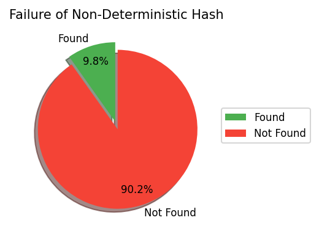

**Explanation:**
- When inserting, the key "apple" is placed in a random slot.
- When searching, "apple" is looked up in a different random slot, so the search almost always fails.
- This demonstrates that a non-deterministic hash function makes the hash table unusable.

#### **Uniform Distribution**
Uniform distribution ensures that hash values are spread evenly across all slots. This minimizes collisions (multiple keys mapping to the same slot), which is crucial for maintaining fast lookup, insertion, and deletion times.

If a hash function is not uniform, some slots will be crowded (many keys), while others are empty. This leads to more collisions and degrades performance.

Here is the visualization for the Uniform Distribution:
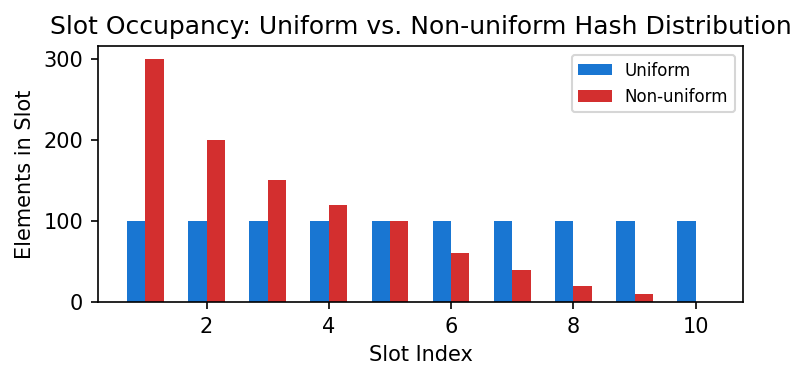


**Example:**
Suppose you have 10 slots and 1000 elements. Ideally, each slot has 100 elements. If you use separate chaining (linked lists in each slot), the average number of comparisons to find an existing element is about 100/2 = 50 (since on average, the element is in the middle of the list). If the distribution is uneven, some slots may have 300 elements, and searching in those slots could take up to 150 comparisons on average, making the hash table much slower.

**Tips:**
- For a slot with $$n$$ elements (using chaining):
    - Average comparisons for a successful search: $$n/2$$

**Summary:**
- Determinism guarantees correctness.
- Uniform distribution guarantees efficiency.


### 4.3 Time Complexity

| Operation | Average Case | Worst Case |
|-----------|--------------|------------|
| Search    | $$\mathcal{O}$$(1)         | $$\mathcal{O}$$(n)       |
| Insert    |$$\mathcal{O}$$(1)         | $$\mathcal{O}$$(n)       |
| Delete    | $$\mathcal{O}$$(1)         | $$\mathcal{O}$$(n)       |

### 4.4 Space Complexity
- Space Complexity: O(n), where n is the number of stored elements

## 5. Applications

1. **Database Indexing**
2. **Cache Systems**
3. **Dictionary Implementation**
4. **Compiler Symbol Tables**
5. **Routing Tables**

## 6. Code Examples

### 6.1 Implementation

```python
class HashTable:
    def __init__(self, size):
        self.size = size
        self.table = [[] for _ in range(size)]
    
    def hash_function(self, key):
        return hash(key) % self.size
    
    def insert(self, key, value):
        index = self.hash_function(key)
        self.table[index].append((key, value))
    
    def search(self, key):
        index = self.hash_function(key)
        for k, v in self.table[index]:
            if k == key:
                return v
        return None
```

```java
// Java Implementation
import java.util.LinkedList;

class HashTable<K, V> {
    private class Entry {
        K key;
        V value;
        Entry(K key, V value) {
            this.key = key;
            this.value = value;
        }
    }

    private LinkedList<Entry>[] table;
    private int size;

    public HashTable(int size) {
        this.size = size;
        table = new LinkedList[size];
        for (int i = 0; i < size; i++) {
            table[i] = new LinkedList<>();
        }
    }

    private int hashFunction(K key) {
        return Math.abs(key.hashCode()) % size;
    }

    public void insert(K key, V value) {
        int index = hashFunction(key);
        table[index].add(new Entry(key, value));
    }

    public V search(K key) {
        int index = hashFunction(key);
        for (Entry entry : table[index]) {
            if (entry.key.equals(key)) {
                return entry.value;
            }
        }
        return null;
    }
}
```

### 6.3 Usage Example 

```python
# Create hash table
ht = HashTable(10)

# Insert data
ht.insert("apple", 1)
ht.insert("banana", 2)
ht.insert("orange", 3)

# Search data
print(ht.search("apple"))  # Output: 1
print(ht.search("banana")) # Output: 2
```

```java
// Usage Example (Java)
public class Main {
    public static void main(String[] args) {
        HashTable<String, Integer> ht = new HashTable<>(10);
        ht.insert("apple", 1);
        ht.insert("banana", 2);
        ht.insert("orange", 3);

        System.out.println(ht.search("apple"));   // Output: 1
        System.out.println(ht.search("banana"));  // Output: 2
        System.out.println(ht.search("grape"));   // Output: null
    }
}
```
## Load Factor

**Load Factor** (often denoted as α) is a measure of how full a hash table is. It is defined as:

```
Load Factor = Number of elements in table / Table size
```

- For example, if a hash table has 10 slots and 7 elements, the load factor is 0.7.

**Why is Load Factor important?**
- A higher load factor increases the probability of collisions, which can slow down search, insert, and delete operations.
- A lower load factor means more empty slots, so operations are faster, but space is less efficiently used.
- Most hash table implementations automatically resize (rehash) the table when the load factor exceeds a certain threshold (commonly 0.7 or 0.75) to maintain good performance.

**Recommended Ranges:**
- For open hashing: load factor can be >1, but usually α ≤ 1 is preferred.
- For closed hashing: keep the load factor below 0.7–0.8 for best performance.

**Typical thresholds:**
- Python `dict`: threshold ≈ 0.66
- Java `HashMap`: default load factor is 0.75

**Summary:**
- The load factor is a key parameter for hash table efficiency.
- Too high: more collisions, slower operations.
- Too low: wasted space.
- Choose a threshold that balances speed and space, and resize the table when necessary.

| Load Factor (α) | Collision Probability | Search/Insert Efficiency | Space Utilization |
|-----------------|----------------------|-------------------------|-------------------|
| 0.2 | Very low | Very fast | Low |
| 0.5 | Moderate | Fast | Fairly high |
| 0.75 | High | Slower | High |
| 1.0 | Very high | Very slow | Very high |


## 7. Best Practices

1. **Choose Appropriate Hash Function**
   - Uniform distribution
   - Fast computation
   - Minimal collisions

2. **Set Initial Size Appropriately**
   - Avoid frequent resizing
   - Control load factor

3. **Handle Collisions**
   - Choose collision handling method based on requirements
   - Monitor collision rate

## 8. Common Questions

1. **How to Choose a Hash Function?**
   - Consider data characteristics
   - Test distribution uniformity
   - Evaluate computation efficiency

2. **How to Handle Hash Table Resizing?**
   - Set appropriate resize threshold
   - Rehash all elements
   - Maintain data consistency

3. **How to Optimize Performance?**
   - Use appropriate collision handling method
   - Regularly clean up unused data
   - Monitor performance metrics 

## 9. References

- Thomas H. Cormen, Charles E. Leiserson, Ronald L. Rivest, Clifford Stein. "Introduction to Algorithms", 3rd Edition, MIT Press, Chapter 11.
- Wikipedia contributors, "Hash table", Wikipedia, The Free Encyclopedia. [Link](https://en.wikipedia.org/wiki/Hash_table)
- Donald E. Knuth, "The Art of Computer Programming, Volume 3: Sorting and Searching", Addison-Wesley. 