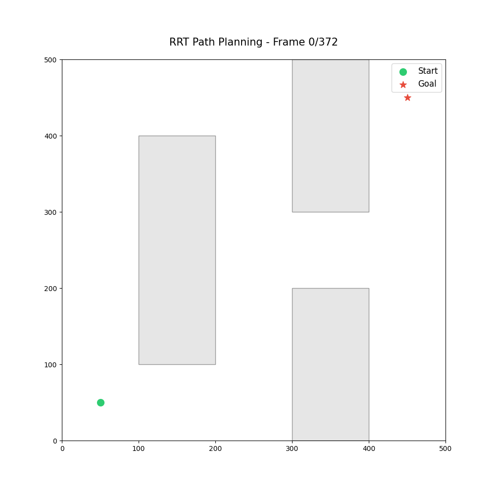
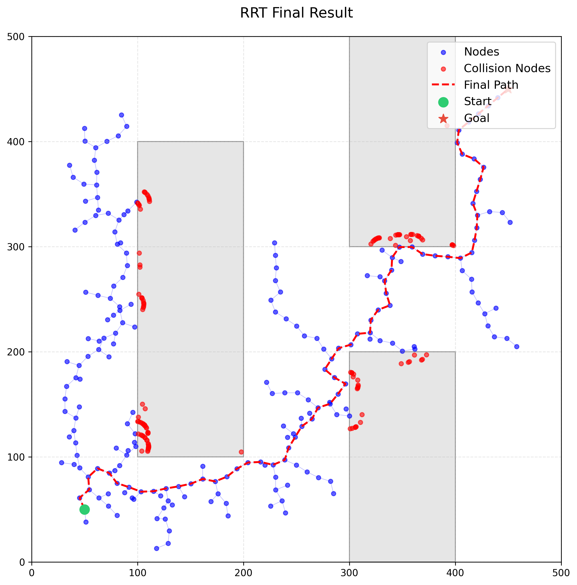

# Rapidly-exploring Random Tree

Finished :sunglasses:
{: .label .label-red }

Path planning is a fundamental problem in robotics, especially when navigating complex environments with obstacles. The Rapidly-exploring Random Tree (RRT) algorithm is a popular sampling-based method for efficiently searching high-dimensional spaces by randomly building a space-filling tree.

## What is RRT?

RRT incrementally builds a tree rooted at the start configuration by randomly sampling points in the space and connecting them to the nearest node in the tree, as long as the path is collision-free. This approach is particularly effective for problems with obstacles and high-dimensional configuration spaces, where traditional grid-based methods become computationally expensive.

Key features of RRT:
- **Random Sampling:** The algorithm explores the space by randomly sampling points, which helps it quickly find feasible paths in large or cluttered environments.
- **Tree Expansion:** Each new sample is connected to the nearest existing node, growing the tree towards unexplored regions.
- **Obstacle Avoidance:** The algorithm checks for collisions before adding new branches, ensuring the path remains feasible.

## RRT in Action

The following animation demonstrates the RRT algorithm in a 2D environment with obstacles. The green circle marks the start position, and the red star marks the goal. The tree expands by exploring the free space, avoiding obstacles, and eventually finding a path to the goal.

<div align="center">
  
</div>

After the algorithm completes, the final result shows all explored nodes, collision points, and the successful path from start to goal:

<div align="center">
  
</div>

- **Blue dots:** All nodes explored by the RRT.
- **Red dots:** Nodes where collisions with obstacles occurred.
- **Red dashed line:** The final path found by the algorithm.
- **Green circle:** Start position.
- **Red star:** Goal position.

## RRT Pseudocode

```julia
RRT(start, goal, max_iter):
    initialize tree T with start node
    for i = 1 to max_iter:
        x_rand ← sample_random_point()
        x_nearest ← nearest_node(T, x_rand)
        x_new ← steer(x_nearest, x_rand)
        if path from x_nearest to x_new is collision-free:
            add x_new to T with edge from x_nearest
            if x_new is close enough to goal:
                return extract_path(T, x_new)
    return failure
```

This process allows RRT to efficiently explore the space and find feasible paths even in the presence of complex obstacles.

RRT is widely used in robotics for its simplicity and effectiveness, especially in environments where obstacles make path planning challenging. Its ability to quickly explore large spaces makes it a valuable tool for real-time robotic applications.

## References

- S. M. LaValle, J. J. Kuffner Jr., "Rapidly-Exploring Random Trees: Progress and Prospects," Algorithmic and Computational Robotics: New Directions, 2000. ([PDF](http://msl.cs.uiuc.edu/~lavalle/papers/LavKuf01.pdf))
- S. M. LaValle, "Planning Algorithms," Cambridge University Press, 2006. ([Online Book, Chapter 5.4](http://planning.cs.uiuc.edu/))
- Wikipedia contributors, "Rapidly-exploring random tree," Wikipedia, The Free Encyclopedia. ([Link](https://en.wikipedia.org/wiki/Rapidly-exploring_random_tree))

