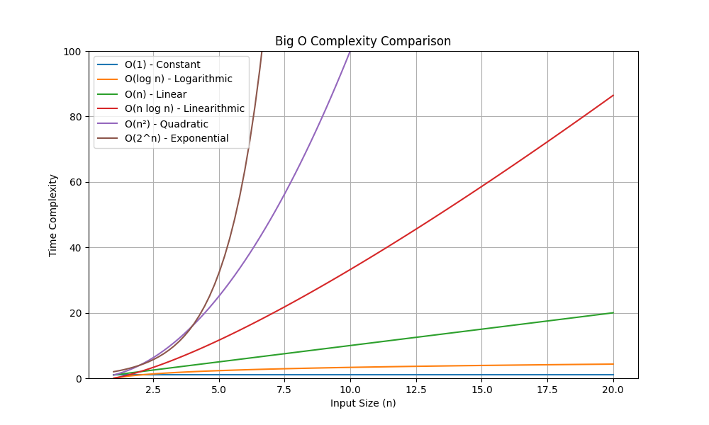

# Big O Notation

**Big O Notation** is a mathematical notation used to describe the performance or complexity of an algorithm. It describes how the runtime or space requirements grow as the input size grows.

## Common Big O Complexities

```
O(1)     - Constant time
O(log n) - Logarithmic time
O(n)     - Linear time
O(n log n) - Linearithmic time
O(n²)    - Quadratic time
O(2^n)   - Exponential time
O(n!)    - Factorial time
```

### Complexity Comparison Table

| Complexity | Name | Example | Description |
|------------|------|---------|-------------|
| O(1) | Constant | Array access | Time remains constant regardless of input size |
| O(log n) | Logarithmic | Binary search | Time increases logarithmically with input size |
| O(n) | Linear | Linear search | Time increases linearly with input size |
| O(n log n) | Linearithmic | Merge sort | Time increases by n * log n with input size |
| O(n²) | Quadratic | Bubble sort | Time increases quadratically with input size |
| O(2^n) | Exponential | Fibonacci recursive | Time doubles with each additional input |
| O(n!) | Factorial | Traveling salesman | Time increases factorially with input size |

### Real-world Examples

| Operation | Complexity | Example |
|-----------|------------|---------|
| Array access | O(1) | `arr[5]` |
| Binary search | O(log n) | Finding a number in sorted array |
| Linear search | O(n) | Finding a number in unsorted array |
| Sorting | O(n log n) | Merge sort, Quick sort |
| Nested loops | O(n²) | Bubble sort, Selection sort |
| Recursive Fibonacci | O(2^n) | `fib(n) = fib(n-1) + fib(n-2)` |
| Permutations | O(n!) | Generating all possible arrangements |

## Complexity Graph




## Binary Search Complexity Analysis

Let's analyze the time complexity of Binary Search:

### Best Case: O(1)
- When the target element is found at the middle of the array
- Example: Searching for 7 in [1, 3, 5, 7, 9, 11, 13, 15]
- Only one comparison is needed

### Average Case: O(log n)
- On average, we need to search half of the remaining elements
- Each step reduces the search space by half
- Example: Searching for 5 in [1, 3, 5, 7, 9, 11, 13, 15]
- Takes approximately log₂(n) steps

### Worst Case: O(log n)
- When the target element is not in the array
- Need to search until the array is empty
- Example: Searching for 6 in [1, 3, 5, 7, 9, 11, 13, 15]
- Takes log₂(n) steps to determine element is not present

## Why Binary Search is O(log n)?

Let's understand with an example:
```
Array size: 8
Step 1: 8 elements → 4 elements
Step 2: 4 elements → 2 elements
Step 3: 2 elements → 1 element
```

For an array of size n:
- After 1st step: n/2 elements
- After 2nd step: n/4 elements
- After 3rd step: n/8 elements
- After k steps: n/2^k elements

When n/2^k = 1:
- n = 2^k
- k = log₂(n)

Therefore, binary search takes O(log n) time in worst and average cases.
