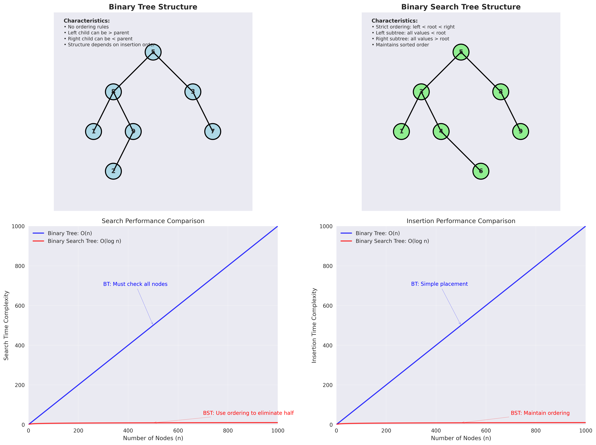
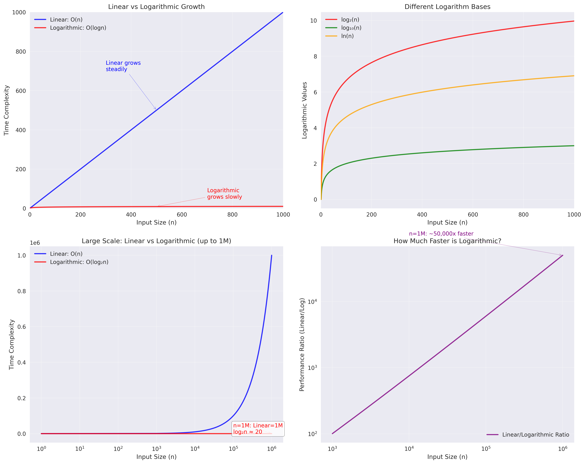

# Binary Tree vs Binary Search Tree: Comprehensive Comparison

## Overview
This document provides a detailed comparison between Binary Trees (BT) and Binary Search Trees (BST), including their structures, operations, performance characteristics, and practical applications. We'll explore the key differences and when to use each data structure.

## Basic Definitions

### Binary Tree (BT)
A hierarchical data structure where each node has at most two children, with **no ordering constraints**.

### Binary Search Tree (BST)
A binary tree with **strict ordering constraints**: left subtree values < root value < right subtree values.

## Structural Comparison

### Visual Representation



*Figure: Comprehensive comparison of Binary Tree vs Binary Search Tree structures and performance characteristics. The top row shows structural differences, while the bottom row demonstrates performance comparisons.*

#### Binary Tree Structure
```
       5
      / \
     8   3
    / \   \
   1   9   7
      /
     2

Characteristics:
- No ordering rules
- Left child can be > parent
- Right child can be < parent
- Structure depends on insertion order
```

#### Binary Search Tree Structure
```
       5
      / \
     3   8
    / \   \
   1   4   9
      \
       6

Characteristics:
- Strict ordering: left < root < right
- Left subtree: all values < root
- Right subtree: all values > root
- Maintains sorted order
```

## Implementation Comparison

### Node Structure
Both use the same basic node structure:

```java
class Node<T> {
    T data;
    Node<T> left;
    Node<T> right;
    
    public Node(T data) {
        this.data = data;
        this.left = null;
        this.right = null;
    }
}
```

### Insertion Operations

#### Binary Tree Insertion
```java
class BinaryTree<T> {
    Node<T> root;
    
    public void insert(T data) {
        root = insertRec(root, data);
    }
    
    private Node<T> insertRec(Node<T> root, T data) {
        if (root == null) {
            return new Node<>(data);
        }
        
        // Simple insertion strategy: fill left, then right
        if (root.left == null) {
            root.left = insertRec(root.left, data);
        } else if (root.right == null) {
            root.right = insertRec(root.right, data);
        } else {
            // If both children exist, insert into left subtree
            root.left = insertRec(root.left, data);
        }
        
        return root;
    }
}
```

#### Binary Search Tree Insertion
```java
class BinarySearchTree<T extends Comparable<T>> {
    Node<T> root;
    
    public void insert(T data) {
        root = insertRec(root, data);
    }
    
    private Node<T> insertRec(Node<T> root, T data) {
        if (root == null) {
            return new Node<>(data);
        }
        
        // Follow BST ordering rules
        if (data.compareTo(root.data) < 0) {
            root.left = insertRec(root.left, data);
        } else if (data.compareTo(root.data) > 0) {
            root.right = insertRec(root.right, data);
        }
        // Equal values can be handled as needed
        
        return root;
    }
}
```

## Search Operations Comparison

### Binary Tree Search
```java
class BinaryTree<T> {
    public boolean search(T data) {
        return searchRec(root, data);
    }
    
    private boolean searchRec(Node<T> root, T data) {
        if (root == null) return false;
        
        if (root.data.equals(data)) return true;
        
        // Must search both subtrees
        return searchRec(root.left, data) || searchRec(root.right, data);
    }
}
```

### Binary Search Tree Search
```java
class BinarySearchTree<T extends Comparable<T>> {
    public boolean search(T data) {
        return searchRec(root, data);
    }
    
    private boolean searchRec(Node<T> root, T data) {
        if (root == null) return false;
        
        if (root.data.equals(data)) return true;
        
        // Use ordering to eliminate one subtree
        if (data.compareTo(root.data) < 0) {
            return searchRec(root.left, data);  // Only search left
        } else {
            return searchRec(root.right, data); // Only search right
        }
    }
}
```

## Performance Analysis

### Time Complexity Comparison

| Operation | Binary Tree | Binary Search Tree |
|-----------|-------------|-------------------|
| **Insertion** | O(n) | O(log n) |
| **Search** | O(n) | O(log n) |
| **Deletion** | O(n) | O(log n) |
| **Traversal** | O(n) | O(n) |
| **Min/Max** | O(n) | O(log n) |

### Space Complexity
Both structures have the same space complexity:
- **Worst Case**: O(n) - when tree becomes a linked list
- **Best Case**: O(log n) - when tree is balanced

### Performance Visualization

The comprehensive comparison chart above shows both structural differences and performance characteristics. For detailed performance analysis, see also:



*Figure: Performance comparison showing the dramatic difference between linear O(n) and logarithmic O(log n) operations.*

## Detailed Performance Analysis

The performance differences between Binary Trees and Binary Search Trees are clearly illustrated in the comparison chart above. Let's examine the search and insertion processes in detail:

### Search Performance Comparison

#### Binary Tree Search Process
```
Searching for value 7 in BT:
       5
      / \
     8   3
    / \   \
   1   9   7
      /
     2

Search Steps:
1. Check root (5) → not found
2. Check left subtree (8) → not found
3. Check left subtree of 8 (1) → not found
4. Check right subtree of 8 (9) → not found
5. Check left subtree of 9 (2) → not found
6. Check right subtree of 5 (3) → not found
7. Check right subtree of 3 (7) → found!

Total comparisons: 7 (worst case: n)
```

#### Binary Search Tree Search Process
```
Searching for value 7 in BST:
       5
      / \
     3   8
    / \   \
   1   4   9
      \
       6

Search Steps:
1. Check root (5) → 7 > 5, go right
2. Check node (8) → 7 < 8, go left
3. Check node (6) → 7 > 6, go right
4. Found 7!

Total comparisons: 4 (worst case: log n)
```

### Insertion Performance Comparison

#### Binary Tree Insertion
```java
// Insertion strategy affects tree shape
BinaryTree<Integer> bt = new BinaryTree<>();
bt.insert(5);  // Root
bt.insert(3);  // Left child
bt.insert(8);  // Right child
bt.insert(1);  // Left of left
bt.insert(4);  // Right of left
bt.insert(7);  // Left of right
bt.insert(9);  // Right of right

// Result: balanced tree by chance
// But no guarantee of balance
```

#### Binary Search Tree Insertion
```java
// Insertion maintains ordering
BinarySearchTree<Integer> bst = new BinarySearchTree<>();
bst.insert(5);  // Root
bst.insert(3);  // Left (3 < 5)
bst.insert(8);  // Right (8 > 5)
bst.insert(1);  // Left of left (1 < 3)
bst.insert(4);  // Right of left (4 > 3, 4 < 5)
bst.insert(7);  // Left of right (7 < 8, 7 > 5)
bst.insert(9);  // Right of right (9 > 8)

// Result: automatically sorted
// But may become unbalanced
```

## Practical Applications

### Binary Tree Applications

#### 1. Expression Trees
```java
// Mathematical expression: (3 + 4) * 2
class ExpressionTree {
    class Node {
        String value;  // Operator or operand
        Node left, right;
    }
    
    // Tree structure:
    //       *
    //      / \
    //     +   2
    //    / \
    //   3   4
    
    public int evaluate(Node root) {
        if (root == null) return 0;
        
        // If leaf node (operand)
        if (root.left == null && root.right == null) {
            return Integer.parseInt(root.value);
        }
        
        // Evaluate subtrees
        int leftVal = evaluate(root.left);
        int rightVal = evaluate(root.right);
        
        // Apply operator
        switch (root.value) {
            case "+": return leftVal + rightVal;
            case "*": return leftVal * rightVal;
            default: return 0;
        }
    }
}
```

#### 2. File System Trees
```java
class FileSystemTree {
    class Node {
        String name;
        boolean isDirectory;
        Node left, right;  // Child files/folders
    }
    
    // Tree structure:
    //     📁 Root
    //    /        \
    // 📁 Docs    📁 Pictures
    //   /  \        /     \
    // 📄 A  📄 B  📄 C   📄 D
}
```

#### 3. Decision Trees
```java
class DecisionTree {
    class Node {
        String question;
        Node left, right;  // Yes/No branches
    }
    
    // Tree structure:
    //     Is it raining?
    //    /              \
    //  Yes              No
    //   |                |
    // Stay inside    Go outside
}
```

### Binary Search Tree Applications

#### 1. Database Indexing
```java
class DatabaseIndex {
    class User {
        int id;
        String name;
        String email;
    }
    
    BinarySearchTree<Integer> idIndex = new BinarySearchTree<>();
    
    public void addUser(User user) {
        idIndex.insert(user.id);
    }
    
    public boolean findUser(int id) {
        return idIndex.search(id);  // O(log n) lookup
    }
}
```

#### 2. Dictionary Implementation
```java
class Dictionary {
    BinarySearchTree<String> words = new BinarySearchTree<>();
    
    public void addWord(String word) {
        words.insert(word.toLowerCase());
    }
    
    public boolean containsWord(String word) {
        return words.search(word.toLowerCase());  // O(log n) lookup
    }
    
    public List<String> getWordsInRange(String start, String end) {
        // In-order traversal gives sorted words
        return words.inOrderTraversal().stream()
                   .filter(word -> word.compareTo(start) >= 0 && 
                                  word.compareTo(end) <= 0)
                   .collect(Collectors.toList());
    }
}
```

#### 3. Priority Queue
```java
class PriorityQueue<T extends Comparable<T>> {
    BinarySearchTree<T> tree = new BinarySearchTree<>();
    
    public void enqueue(T item) {
        tree.insert(item);
    }
    
    public T dequeue() {
        T min = tree.findMin();  // O(log n)
        tree.delete(min);
        return min;
    }
    
    public T peek() {
        return tree.findMin();  // O(log n)
    }
}
```

## Memory Usage Comparison

### Binary Tree Memory
```java
// Memory layout example
BinaryTree<Integer> bt = new BinaryTree<>();
bt.insert(5);
bt.insert(8);
bt.insert(3);

// Memory allocation:
// Node 5: [data=5, left=ref_to_8, right=ref_to_3]
// Node 8: [data=8, left=null, right=null]
// Node 3: [data=3, left=null, right=null]
```

### Binary Search Tree Memory
```java
// Memory layout example
BinarySearchTree<Integer> bst = new BinarySearchTree<>();
bst.insert(5);
bst.insert(3);
bst.insert(8);

// Memory allocation:
// Node 5: [data=5, left=ref_to_3, right=ref_to_8]
// Node 3: [data=3, left=null, right=null]
// Node 8: [data=8, left=null, right=null]

// Same memory usage, different organization
```

## When to Use Each Structure

### Choose Binary Tree When:
- **No ordering requirements**
- **Hierarchical data representation**
- **Expression evaluation**
- **File system modeling**
- **Decision tree algorithms**
- **Simple tree operations**

### Choose Binary Search Tree When:
- **Sorted data requirements**
- **Fast search operations**
- **Database indexing**
- **Dictionary implementation**
- **Priority queue**
- **Range queries**

## Code Examples with Visualization

### Binary Tree Implementation with Visualization
```java
class BinaryTree<T> {
    Node<T> root;
    
    public void insert(T data) {
        root = insertRec(root, data);
    }
    
    private Node<T> insertRec(Node<T> root, T data) {
        if (root == null) {
            return new Node<>(data);
        }
        
        // Simple insertion: fill left, then right
        if (root.left == null) {
            root.left = insertRec(root.left, data);
        } else if (root.right == null) {
            root.right = insertRec(root.right, data);
        } else {
            root.left = insertRec(root.left, data);
        }
        
        return root;
    }
    
    public void printTree() {
        printTreeRec(root, 0);
    }
    
    private void printTreeRec(Node<T> root, int depth) {
        if (root == null) return;
        
        // Print right subtree
        printTreeRec(root.right, depth + 1);
        
        // Print current node
        String indent = "  ".repeat(depth);
        System.out.println(indent + root.data);
        
        // Print left subtree
        printTreeRec(root.left, depth + 1);
    }
}
```

### Binary Search Tree Implementation with Visualization
```java
class BinarySearchTree<T extends Comparable<T>> {
    Node<T> root;
    
    public void insert(T data) {
        root = insertRec(root, data);
    }
    
    private Node<T> insertRec(Node<T> root, T data) {
        if (root == null) {
            return new Node<>(data);
        }
        
        // Follow BST ordering
        if (data.compareTo(root.data) < 0) {
            root.left = insertRec(root.left, data);
        } else if (data.compareTo(root.data) > 0) {
            root.right = insertRec(root.right, data);
        }
        
        return root;
    }
    
    public void printTree() {
        printTreeRec(root, 0);
    }
    
    private void printTreeRec(Node<T> root, int depth) {
        if (root == null) return;
        
        // Print right subtree
        printTreeRec(root.right, depth + 1);
        
        // Print current node
        String indent = "  ".repeat(depth);
        System.out.println(indent + root.data);
        
        // Print left subtree
        printTreeRec(root.left, depth + 1);
    }
    
    public T findMin() {
        if (root == null) return null;
        Node<T> current = root;
        while (current.left != null) {
            current = current.left;
        }
        return current.data;
    }
    
    public T findMax() {
        if (root == null) return null;
        Node<T> current = root;
        while (current.right != null) {
            current = current.right;
        }
        return current.data;
    }
}
```

## Performance Testing

### Test Code
```java
public class TreePerformanceTest {
    public static void main(String[] args) {
        int n = 10000;
        
        // Test Binary Tree
        BinaryTree<Integer> bt = new BinaryTree<>();
        long start = System.currentTimeMillis();
        for (int i = 0; i < n; i++) {
            bt.insert(i);
        }
        long btInsertTime = System.currentTimeMillis() - start;
        
        start = System.currentTimeMillis();
        for (int i = 0; i < n; i++) {
            bt.search(i);
        }
        long btSearchTime = System.currentTimeMillis() - start;
        
        // Test Binary Search Tree
        BinarySearchTree<Integer> bst = new BinarySearchTree<>();
        start = System.currentTimeMillis();
        for (int i = 0; i < n; i++) {
            bst.insert(i);
        }
        long bstInsertTime = System.currentTimeMillis() - start;
        
        start = System.currentTimeMillis();
        for (int i = 0; i < n; i++) {
            bst.search(i);
        }
        long bstSearchTime = System.currentTimeMillis() - start;
        
        System.out.println("Performance Comparison (n=" + n + "):");
        System.out.println("Binary Tree:");
        System.out.println("  Insertion: " + btInsertTime + "ms");
        System.out.println("  Search: " + btSearchTime + "ms");
        System.out.println("Binary Search Tree:");
        System.out.println("  Insertion: " + bstInsertTime + "ms");
        System.out.println("  Search: " + bstSearchTime + "ms");
    }
}
```

## Summary

| Aspect | Binary Tree | Binary Search Tree |
|--------|-------------|-------------------|
| **Ordering** | No constraints | Left < Root < Right |
| **Search** | O(n) - must check all nodes | O(log n) - use ordering |
| **Insertion** | O(n) - simple placement | O(log n) - maintain order |
| **Applications** | Expression trees, file systems | Database indexes, dictionaries |
| **Complexity** | Simple to implement | More complex but efficient |
| **Memory** | Same space usage | Same space usage |
| **Balance** | No guarantee | May become unbalanced |

### Key Takeaways

1. **Binary Trees** are simpler but less efficient for search operations
2. **Binary Search Trees** provide fast search but require maintaining order
3. **Choose based on your primary use case**: hierarchy vs search efficiency
4. **Both structures** have the same space complexity
5. **BST operations** are more complex but provide better performance

The choice between Binary Tree and Binary Search Tree depends on whether you need fast search operations and sorted data, or if you just need a hierarchical structure without ordering constraints. 