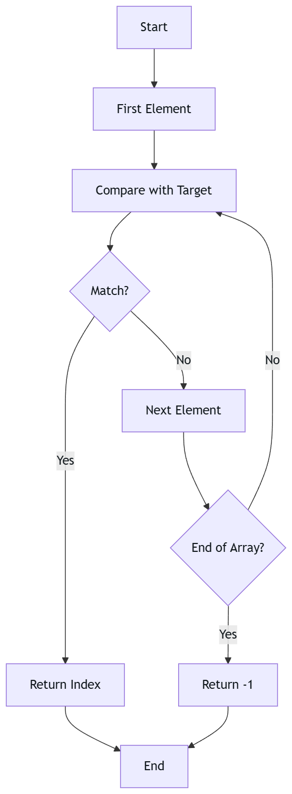

# Linear Search

Linear Search is the simplest way to search and check the elements in the list :sunglasses:. 

### Flowchart:


Let's visualize the search process with an example array `[10, 20, 30, 40, 50]` and target `30`:

| Step | Current Element | Compare with Target (30) | Action |
|------|----------------|------------------------|---------|
| 1    | 10            | 10 ≠ 30               | Move to next |
| 2    | 20            | 20 ≠ 30               | Move to next |
| 3    | 30            | 30 = 30               | <span style="color: red">Found! Return index 2</span> |
| 4    | 40            | Not reached           | Search stops |
| 5    | 50            | Not reached           | Search stops |

## Implementation

### Java Implementation
```java
public class LinearSearch {
    public static void main(String[] args) {
        // Create test array
        int[] arr = {10, 20, 30, 40, 50};
        int target = 30;
        
        // Call linear search method
        int result = linearSearch(arr, target);
        
        // Print result
        if (result == -1) {
            System.out.println("Element not found");
        } else {
            System.out.println("Element found at index: " + result);
        }
    }

    public static int linearSearch(int[] arr, int target) {
        // Iterate through each element
        for (int i = 0; i < arr.length; i++) {
            // If element found, return its index
            if (arr[i] == target) {
                return i;
            }
        }
        // Element not found
        return -1;
    }
}
```

### Python Implementation
```python
def linear_search(arr, target):
    for i in range(len(arr)):
        if arr[i] == target:
            return i
    return -1

# Test the function
arr = [10, 20, 30, 40, 50]
target = 30
result = linear_search(arr, target)

if result == -1:
    print("Element not found")
else:
    print("Element found at index:", result)
```