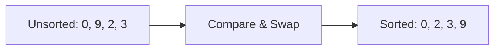

# Sorting

**Sorting** in Java means arranging elements in a collection (array, list, etc.) in a specific order (ascending or descending).

**Key Points:**
- **Compare** two elements and **swap** if out of order
- Repeat until all elements are sorted (**in-place**)
- Sort by **key** (e.g., last name), value can hold more info
- **Stable sort**: keeps order of equal keys
- Use `Comparable<E>` or `Comparator<T>` for custom order

**Example Table: Before and After Sorting**

| Index | Before | After  |
|-------|--------|--------|
| 0     |  0     |   0    |
| 1     |  9     |   2    |
| 2     |  2     |   3    |
| 3     |  3     |   9    |

**Visualization:**



# Bubble Sort

**Bubble Sort** is a simple sorting algorithm that repeatedly steps through the list, compares adjacent elements, and swaps them if they are in the wrong order. This process is repeated until the list is sorted. The largest elements "bubble up" to the end of the list with each pass.

**How it works:**
- Compare each pair of adjacent elements
- Swap them if they are out of order
- Repeat for all elements until no swaps are needed

**Visualization:**
Source code for visualization [code](sort_visualization.py)


**Bubble Sort Java Implementation:**

```java
public class BubbleSortDemo {
    public static void bubbleSort(int[] arr) {
        int n = arr.length;
        for (int i = 0; i < n - 1; i++) {
            for (int j = 0; j < n - 1 - i; j++) {
                if (arr[j] > arr[j + 1]) {
                    // Swap arr[j] and arr[j + 1]
                    int temp = arr[j];
                    arr[j] = arr[j + 1];
                    arr[j + 1] = temp;
                }
            }
        }
    }

    public static void main(String[] args) {
        int[] arr = {0, 9, 2, 3};
        bubbleSort(arr);
        for (int num : arr) {
            System.out.print(num + " ");
        }
        // Output: 0 2 3 9
    }
}
```