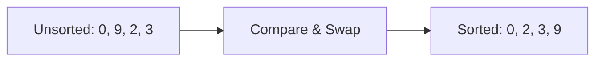
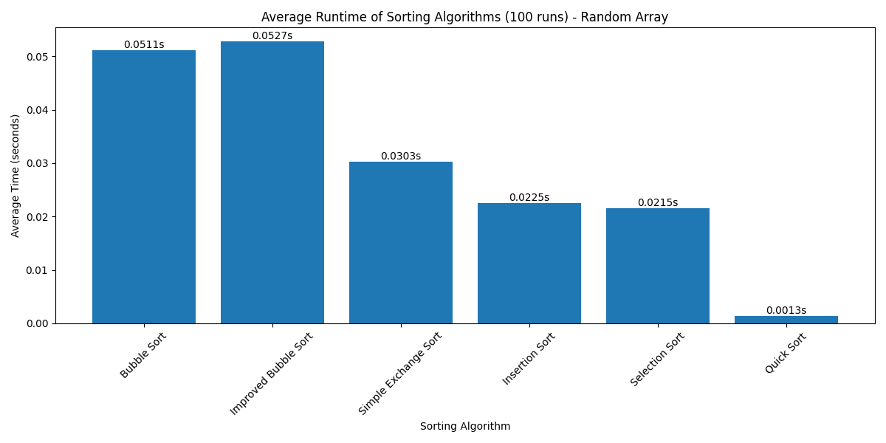
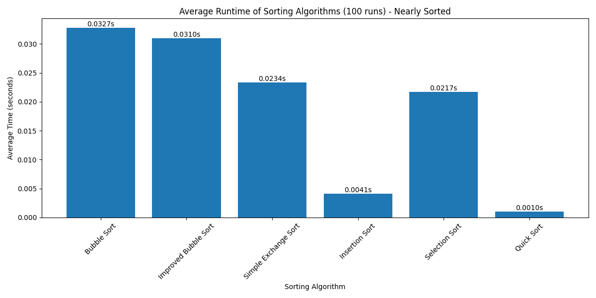
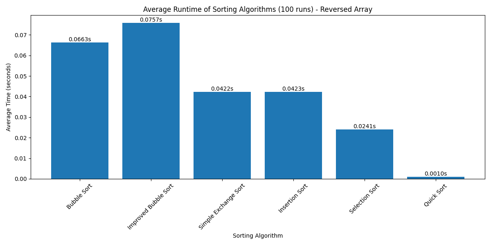

# Sorting
[Source code](sort_visualization.py) for visualization 

**Sorting** in Java means arranging elements in a collection (array, list, etc.) in a specific order (ascending or descending).

**Key Points:**
- **Compare** two elements and **swap** if out of order
- Repeat until all elements are sorted (**in-place**)
- Sort by **key** (e.g., last name), value can hold more info
- **Stable sort**: keeps order of equal keys
- Use `Comparable<E>` or `Comparator<T>` for custom order

**Example Table: Before and After Sorting**

| Index | Before | After  |
|-------|--------|--------|
| 0     |  0     |   0    |
| 1     |  9     |   2    |
| 2     |  2     |   3    |
| 3     |  3     |   9    |

**Visualization:**



# Bubble Sort

**Bubble Sort** is a simple sorting algorithm that repeatedly steps through the list, compares adjacent elements, and swaps them if they are in the wrong order. This process is repeated until the list is sorted. The largest elements "bubble up" to the end of the list with each pass.

**How it works:**
- Compare each pair of adjacent elements
- Swap them if they are out of order
- Repeat for all elements until no swaps are needed

**Visualization:**


**Bubble Sort Java Implementation:**

```java
public class BubbleSortDemo {
    public static void bubbleSort(int[] arr) {
        int n = arr.length;
        for (int i = 0; i < n - 1; i++) {
            for (int j = 0; j < n - 1 - i; j++) {
                if (arr[j] > arr[j + 1]) {
                    // Swap arr[j] and arr[j + 1]
                    int temp = arr[j];
                    arr[j] = arr[j + 1];
                    arr[j + 1] = temp;
                }
            }
        }
    }

    public static void main(String[] args) {
        int[] arr = {0, 9, 2, 3};
        bubbleSort(arr);
        for (int num : arr) {
            System.out.print(num + " ");
        }
        // Output: 0 2 3 9
    }
}
```

# Improved Bubble Sort

**Improved Bubble Sort** (also called Optimized Bubble Sort) adds a simple optimization: if no swaps are made during a full pass through the array, the algorithm stops early because the array is already sorted.

**Key Idea:**
- Use a flag to check if any swaps happened in the current pass
- If no swaps, the array is sorted and the algorithm can exit early
- This reduces unnecessary passes, especially for nearly sorted arrays

**How it works:**
- For each pass, set a `swapped` flag to `false`
- If any swap occurs, set `swapped` to `true`
- If `swapped` is still `false` after a pass, break the loop

**Visualization**


**Java Implementation:**

```java
public class ImprovedBubbleSortDemo {
    public static void bubbleSort(int[] arr) {
        int n = arr.length;
        boolean swapped;
        for (int i = 0; i < n - 1; i++) {
            swapped = false;
            for (int j = 0; j < n - 1 - i; j++) {
                if (arr[j] > arr[j + 1]) {
                    // Swap arr[j] and arr[j + 1]
                    int temp = arr[j];
                    arr[j] = arr[j + 1];
                    arr[j + 1] = temp;
                    swapped = true;
                }
            }
            // If no swaps occurred, array is sorted
            if (!swapped) break;
        }
    }

    public static void main(String[] args) {
        int[] arr = {0, 9, 2, 3};
        bubbleSort(arr);
        for (int num : arr) {
            System.out.print(num + " ");
        }
        // Output: 0 2 3 9
    }
}
```

**Benefits:**
- Faster for nearly sorted arrays
- Same worst-case time complexity, but better best-case performance (O(n) if already sorted)

# Simple Exchange Sort

**Simple Exchange Sort** is a basic sorting algorithm that works by comparing each element with every other element and swapping them if they are out of order. It is similar to bubble sort but does not repeatedly pass through the array; instead, it compares each element with all subsequent elements.

**Key Points:**
- For each element, compare it with every element that comes after it
- Swap if the current element is greater than the compared element
- Continue until the entire array is sorted

**How it works:**
- Outer loop picks each element one by one
- Inner loop compares it with all elements to its right
- Swap if needed

**Visualization**


**Java Implementation:**

```java
public class SimpleExchangeSortDemo {
    public static void exchangeSort(int[] arr) {
        int n = arr.length;
        for (int i = 0; i < n - 1; i++) {
            for (int j = i + 1; j < n; j++) {
                if (arr[i] > arr[j]) {
                    // Swap arr[i] and arr[j]
                    int temp = arr[i];
                    arr[i] = arr[j];
                    arr[j] = temp;
                }
            }
        }
    }

    public static void main(String[] args) {
        int[] arr = {0, 9, 2, 3};
        exchangeSort(arr);
        for (int num : arr) {
            System.out.print(num + " ");
        }
        // Output: 0 2 3 9
    }
}
```

# Insertion Sort

**Insertion Sort** is a simple and intuitive sorting algorithm that builds the sorted array one element at a time. It works well for small or nearly sorted datasets.

**Key Points:**
- Start from the second element, insert it into the correct position in the sorted part of the array
- Shift larger elements to the right to make space
- Repeat for all elements

**How it works:**
- The left part of the array is always sorted
- Pick the next element and insert it into the sorted part

**Visualization**


**Java Implementation:**

```java
public class InsertionSortDemo {
    public static void insertionSort(int[] arr) {
        int n = arr.length;
        for (int i = 1; i < n; i++) {
            int key = arr[i];
            int j = i - 1;
            // Move elements greater than key to one position ahead
            while (j >= 0 && arr[j] > key) {
                arr[j + 1] = arr[j];
                j--;
            }
            arr[j + 1] = key;
        }
    }

    public static void main(String[] args) {
        int[] arr = {0, 9, 2, 3};
        insertionSort(arr);
        for (int num : arr) {
            System.out.print(num + " ");
        }
        // Output: 0 2 3 9
    }
}
```

# Selection Sort (Max Sort)

**Selection Sort** is a simple comparison-based sorting algorithm. In each pass, it selects the maximum (or minimum) element from the unsorted part and places it at the correct position. The "max sort" version always selects the largest element and moves it to the end of the unsorted section.

**Key Points:**
- Divide the array into a sorted and an unsorted part
- Repeatedly select the maximum element from the unsorted part
- Swap it with the last element of the unsorted part
- After each pass, the sorted part grows from the end

**How it works:**
- For each pass, find the index of the maximum value in the unsorted part
- Swap it with the last unsorted element
- Repeat until the array is sorted

**Visualization**


**Java Implementation (Max Sort):**

```java
public class SelectionSortDemo {
    public static void selectionSort(int[] arr) {
        int n = arr.length;
        for (int i = n - 1; i > 0; i--) {
            int maxIndex = 0;
            for (int j = 1; j <= i; j++) {
                if (arr[j] > arr[maxIndex]) {
                    maxIndex = j;
                }
            }
            // Swap the found maximum with the last element of unsorted part
            int temp = arr[maxIndex];
            arr[maxIndex] = arr[i];
            arr[i] = temp;
        }
    }

    public static void main(String[] args) {
        int[] arr = {0, 9, 2, 3};
        selectionSort(arr);
        for (int num : arr) {
            System.out.print(num + " ");
        }
        // Output: 0 2 3 9
    }
}
```

# Quick Sort

**Quick Sort** is a highly efficient, divide-and-conquer sorting algorithm. It works by selecting a 'pivot' element, partitioning the array into two subarrays (elements less than the pivot and elements greater than the pivot), and then recursively sorting the subarrays.

**Key Points:**
- Choose a pivot element
- Partition the array so that elements less than the pivot are on the left, greater on the right
- Recursively apply the process to the left and right subarrays
- Average time complexity: O(n log n)
- Not stable, but very fast in practice

**How it works:**
- Pick a pivot (commonly the first, last, or middle element)
- Rearrange the array so that all elements less than the pivot come before it, and all greater come after
- Recursively sort the subarrays

**Visualization**


**Java Implementation:**

```java
public class QuickSortDemo {
    public static void quickSort(int[] arr, int left, int right) {
        if (left < right) {
            int pivotIndex = partition(arr, left, right);
            quickSort(arr, left, pivotIndex - 1);
            quickSort(arr, pivotIndex + 1, right);
        }
    }

    private static int partition(int[] arr, int left, int right) {
        int pivot = arr[right]; // Use last element as pivot
        int i = left - 1;
        for (int j = left; j < right; j++) {
            if (arr[j] < pivot) {
                i++;
                int temp = arr[i];
                arr[i] = arr[j];
                arr[j] = temp;
            }
        }
        // Place pivot in the correct position
        int temp = arr[i + 1];
        arr[i + 1] = arr[right];
        arr[right] = temp;
        return i + 1;
    }

    public static void main(String[] args) {
        int[] arr = {0, 9, 2, 3};
        quickSort(arr, 0, arr.length - 1);
        for (int num : arr) {
            System.out.print(num + " ");
        }
        // Output: 0 2 3 9
    }
}
```

# Sorting Algorithms Comparison Table

| Algorithm             | Best Time   | Average Time | Worst Time   | Space Complexity | Stable   | Key Features                                      |
|----------------------|-------------|--------------|--------------|------------------|----------|---------------------------------------------------|
| Bubble Sort          | O(n)        | O(n^2)       | O(n^2)       | O(1)             | Yes      | Simple, swaps adjacent, slow for large data        |
| Improved Bubble Sort | O(n)        | O(n^2)       | O(n^2)       | O(1)             | Yes      | Early exit if sorted, better for nearly sorted     |
| Simple Exchange Sort | O(n^2)      | O(n^2)       | O(n^2)       | O(1)             | No       | Swap on every inversion, many swaps                |
| Insertion Sort       | O(n)        | O(n^2)       | O(n^2)       | O(1)             | Yes      | Good for small/nearly sorted, simple, in-place     |
| Selection Sort       | O(n^2)      | O(n^2)       | O(n^2)       | O(1)             | No       | Fewest swaps, always n(n-1)/2 comparisons         |
| Quick Sort           | O(n log n)  | O(n log n)   | O(n^2)       | O(log n)         | No       | Divide & conquer, very fast in practice            |

**Notes:**
- "Stable" means equal elements keep their original order after sorting.
- Space complexity assumes in-place implementation.
- Quick Sort's worst case is rare with good pivot choice.
- For Selection Sort, the number of comparisons is always n(n-1)/2 = n-1 + n-2 + ... + 1 because for each of the n-1 passes, it compares the current element with every other unsorted element. However, it only swaps once per pass (if needed), resulting in the fewest swaps among simple sorting algorithms.

## Runtime Comparison Visualization

[Source code](sort.py) for experiment

### Random Array Test


The random array test shows the performance of sorting algorithms on completely random data (1000 elements, averaged over 100 runs). Key observations:
1. **Quick Sort** maintains its superior performance with O(n log n) complexity
2. **Simple Exchange Sort** performs better than Bubble Sort due to fewer swaps
3. **Improved Bubble Sort** shows similar performance to regular Bubble Sort on random data
4. **Insertion Sort** and **Selection Sort** show comparable performance

### Nearly Sorted Array Test


The nearly sorted array test (900 sorted elements + 100 random elements) demonstrates:
1. **Insertion Sort** performs exceptionally well, taking advantage of the mostly sorted nature
2. **Improved Bubble Sort** shows significant improvement over regular Bubble Sort
3. **Quick Sort** maintains good performance but is less dominant
4. **Selection Sort** shows consistent performance regardless of input order

### Reversed Array Test


The reversed array test reveals:
1. **Quick Sort** still performs best, demonstrating its robustness
2. **Insertion Sort** performs poorly on reversed data, as it needs to move each element to the beginning
3. **Bubble Sort** and **Improved Bubble Sort** show similar performance on reversed data
4. **Selection Sort** maintains consistent performance, as it always performs the same number of comparisons

These tests demonstrate that the performance of sorting algorithms can vary significantly based on the input data characteristics. While Quick Sort generally performs well across all cases, other algorithms may be more suitable for specific scenarios:
- **Insertion Sort** excels with nearly sorted data
- **Improved Bubble Sort** shows its advantage with partially sorted data
- **Selection Sort** provides consistent performance regardless of input order
- **Simple Exchange Sort** performs better than Bubble Sort on random data due to fewer swaps
