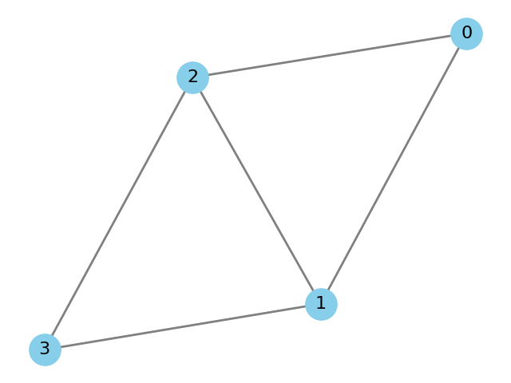
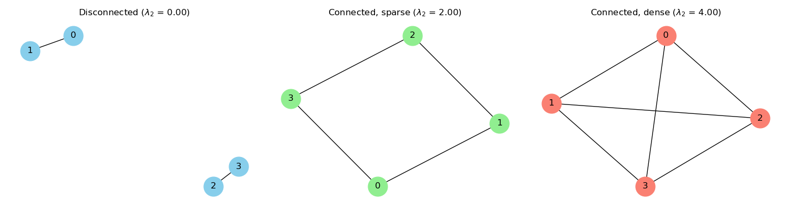

# Graph

## Overview
This document provides a detailed comparison between different graph representations in Java, including Adjacency Matrix and Adjacency List. It covers their structures, operations, performance characteristics, visualizations, and practical applications. We'll also explore a LeetCode example (Clone Graph) that combines graph and hash map usage.

## Basic Definitions

### What is a Graph?
A **graph** is a data structure consisting of a set of **vertices (nodes)** and a set of **edges** connecting pairs of vertices. Graphs can be:
- **Directed** (edges have direction)
- **Undirected** (edges have no direction)
- **Weighted** (edges have weights)
- **Unweighted** (edges have no weights)

### Types of Graphs
- **Undirected Unweighted Graph**: Social networks, friend relationships
- **Directed Weighted Graph**: Road networks, flight routes

## Visual Representation

Below is a simple undirected graph with 4 nodes and 5 edges:

```
   0
  / \
 1---2
  \ /
   3
```


*Figure: A simple undirected graph with 4 nodes and 5 edges.*

In the following sections, we will use this graph as an example to illustrate both the **adjacency matrix** and **adjacency list** representations.

### Adjacency Matrix Representation
```
  0 1 2 3
0 0 1 1 0
1 1 0 1 1
2 1 1 0 1
3 0 1 1 0
```
*Figure: Adjacency matrix representation of the above graph.*

The **adjacency matrix** is a 2D array where the entry at row *i* and column *j* is 1 if there is an edge between node *i* and node *j*, and 0 otherwise. This representation is simple and allows for fast edge lookups (O(1)), but it uses O(V²) space, making it inefficient for large, sparse graphs. It is best suited for dense graphs where most pairs of nodes are connected.

### Adjacency List Representation
```
0: 1, 2
1: 0, 2, 3
2: 0, 1, 3
3: 1, 2
```
*Figure: Adjacency list representation of the above graph.*

The **adjacency list** uses an array (or list) of lists, where each index represents a node and stores a list of its neighbors. This approach is memory-efficient for sparse graphs (O(V+E) space) and is the most common representation in practice. However, checking if an edge exists between two nodes may take O(degree) time, where degree is the number of neighbors of a node.

---

## Mathematical Perspective: Laplacian Matrix and Eigenvalues

For a graph with adjacency matrix $$A$$ and degree matrix $$D$$ (where $$D_{ii}$$ is the degree of node $$i$$), the **Laplacian matrix** $$L$$ is defined as:


$$L = D - A$$


The eigenvalues of $$L$$ are real and non-negative. The second smallest eigenvalue, usually denoted as $$\lambda_2$$, is called the **algebraic connectivity** of the graph.

- $$\lambda_2 > 0$$ if and only if the graph is connected.
- The larger $$\lambda_2$$, the more robustly connected the graph is.
- $$\lambda_2$$ is widely used in spectral graph theory, network robustness, and consensus algorithms.

**Example:**
For the above graph, you can compute $L$ and its eigenvalues to analyze its connectivity properties.

---

### Visualizing $\lambda_2$ in Different Graphs

Below is a comparison of three graphs with different connectivity properties. The value of $$\lambda_2$$ is shown in each subfigure title:


*Figure: Left: Disconnected graph ($$\lambda_2 = 0$$). Middle: Connected but sparse graph (small $$\lambda_2$$). Right: Connected and dense graph (large $$\lambda_2$$).*

- **Left:** The graph is disconnected, so $$\lambda_2 = 0$$.
- **Middle:** The graph is globally connected but has few edges, so $\lambda_2$ is positive but small, indicating weak connectivity.
- **Right:** The graph is globally connected and has many edges, so $\lambda_2$ is much larger, indicating strong connectivity and robustness.

This demonstrates how $\lambda_2$ quantitatively reflects the overall connectivity of a graph.

## Structural Comparison

| Aspect                | Adjacency Matrix         | Adjacency List           |
|-----------------------|-------------------------|--------------------------|
| **Space Complexity**  | O(V^2)                  | O(V + E)                 |
| **Edge Lookup**       | O(1)                    | O(degree)                |
| **Add Edge**          | O(1)                    | O(1)                     |
| **Remove Edge**       | O(1)                    | O(degree)                |
| **Iterate Neighbors** | O(V)                    | O(degree)                |
| **Best For**          | Dense graphs            | Sparse graphs            |

- V: number of vertices
- E: number of edges

## Implementation in Java

### Adjacency Matrix (Undirected Graph)
```java
class GraphMatrix {
    private int V;
    private int[][] matrix;

    public GraphMatrix(int V) {
        this.V = V;
        matrix = new int[V][V];
    }

    public void addEdge(int u, int v) {
        matrix[u][v] = 1;
        matrix[v][u] = 1; // undirected
    }

    public void removeEdge(int u, int v) {
        matrix[u][v] = 0;
        matrix[v][u] = 0;
    }

    public boolean hasEdge(int u, int v) {
        return matrix[u][v] == 1;
    }

    public void printMatrix() {
        for (int i = 0; i < V; i++) {
            for (int j = 0; j < V; j++) {
                System.out.print(matrix[i][j] + " ");
            }
            System.out.println();
        }
    }
}
```

### Adjacency List (Undirected Graph)
```java
import java.util.*;

class GraphList {
    private int V;
    private List<List<Integer>> adj;

    public GraphList(int V) {
        this.V = V;
        adj = new ArrayList<>();
        for (int i = 0; i < V; i++) {
            adj.add(new ArrayList<>());
        }
    }

    public void addEdge(int u, int v) {
        adj.get(u).add(v);
        adj.get(v).add(u); // undirected
    }

    public void removeEdge(int u, int v) {
        adj.get(u).remove((Integer)v);
        adj.get(v).remove((Integer)u);
    }

    public boolean hasEdge(int u, int v) {
        return adj.get(u).contains(v);
    }

    public void printList() {
        for (int i = 0; i < V; i++) {
            System.out.print(i + ": ");
            for (int vtx : adj.get(i)) {
                System.out.print(vtx + " ");
            }
            System.out.println();
        }
    }
}
```

## Common Operations

### Add Node / Edge
- **Adjacency Matrix**: Add row/column (resize array), set matrix[u][v] = 1
- **Adjacency List**: Add new list, add to neighbor lists

### Remove Node / Edge
- **Adjacency Matrix**: Set matrix[u][v] = 0
- **Adjacency List**: Remove from neighbor lists

### Search / Traversal
- **BFS (Breadth-First Search)**
- **DFS (Depth-First Search)**

#### BFS Example (Adjacency List)
```java
public void bfs(int start) {
    boolean[] visited = new boolean[V];
    Queue<Integer> queue = new LinkedList<>();
    visited[start] = true;
    queue.offer(start);
    while (!queue.isEmpty()) {
        int u = queue.poll();
        System.out.print(u + " ");
        for (int v : adj.get(u)) {
            if (!visited[v]) {
                visited[v] = true;
                queue.offer(v);
            }
        }
    }
}
```

#### DFS Example (Adjacency List)
```java
public void dfs(int u, boolean[] visited) {
    visited[u] = true;
    System.out.print(u + " ");
    for (int v : adj.get(u)) {
        if (!visited[v]) {
            dfs(v, visited);
        }
    }
}
```

## Performance Analysis

| Operation         | Adjacency Matrix | Adjacency List |
|-------------------|------------------|----------------|
| Add Edge          | O(1)             | O(1)           |
| Remove Edge       | O(1)             | O(degree)      |
| Check Edge        | O(1)             | O(degree)      |
| Enumerate Neigh.  | O(V)             | O(degree)      |
| Space             | O(V^2)           | O(V+E)         |

- **Adjacency Matrix** is better for dense graphs (many edges)
- **Adjacency List** is better for sparse graphs (few edges)

## Applications
- **Social Networks**: Users and friendships (undirected, sparse)
- **Maps/Navigation**: Cities and roads (directed, weighted)
- **Web Links**: Pages and hyperlinks (directed)
- **Scheduling**: Tasks and dependencies (DAG)
- **Network Routing**: Routers and connections

## LeetCode Example: 133. Clone Graph (with HashMap)

### Problem
Given a reference of a node in a **connected undirected graph**, return a deep copy (clone) of the graph. Use a hash map to avoid revisiting nodes.

[LeetCode 133. Clone Graph](https://leetcode.com/problems/clone-graph/)

### Java Solution (DFS + HashMap)
```java
class Node {
    public int val;
    public List<Node> neighbors;
    public Node() {
        val = 0;
        neighbors = new ArrayList<Node>();
    }
    public Node(int _val) {
        val = _val;
        neighbors = new ArrayList<Node>();
    }
    public Node(int _val, ArrayList<Node> _neighbors) {
        val = _val;
        neighbors = _neighbors;
    }
}

class Solution {
    private Map<Node, Node> visited = new HashMap<>();

    public Node cloneGraph(Node node) {
        if (node == null) return null;
        if (visited.containsKey(node)) {
            return visited.get(node);
        }
        Node clone = new Node(node.val);
        visited.put(node, clone);
        for (Node neighbor : node.neighbors) {
            clone.neighbors.add(cloneGraph(neighbor));
        }
        return clone;
    }
}
```
**Explanation:**
- Use a HashMap<Node, Node> to map original nodes to their clones.
- Prevents infinite loops and duplicate nodes.
- Works for any connected undirected graph.

### More LeetCode Graph Problems
- 207. Course Schedule (Topological Sort)
- 200. Number of Islands (DFS/BFS)
- 785. Is Graph Bipartite?

## Summary Table

| Representation     | Space      | Edge Lookup | Add Edge | Remove Edge | Iterate Neighbors | Best For      |
|-------------------|------------|------------|----------|-------------|-------------------|--------------|
| Adjacency Matrix  | O(V^2)     | O(1)       | O(1)     | O(1)        | O(V)              | Dense Graphs |
| Adjacency List    | O(V + E)   | O(degree)  | O(1)     | O(degree)   | O(degree)         | Sparse Graphs|
| Edge List         | O(E)       | O(E)       | O(1)     | O(E)        | O(E)              | Simple Graphs|

## Key Takeaways
1. **Adjacency Matrix** is simple and fast for dense graphs, but wastes space for sparse graphs.
2. **Adjacency List** is memory-efficient for sparse graphs and is the most common representation.
3. **Edge List** is useful for algorithms that process all edges (e.g., Kruskal's MST).
4. **HashMap** is often used in graph algorithms to track visited nodes or mappings (see LeetCode 133).
5. Choose the representation based on the graph's density and the operations you need to optimize. 