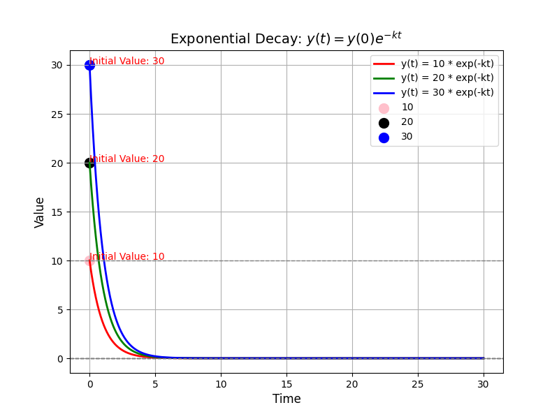
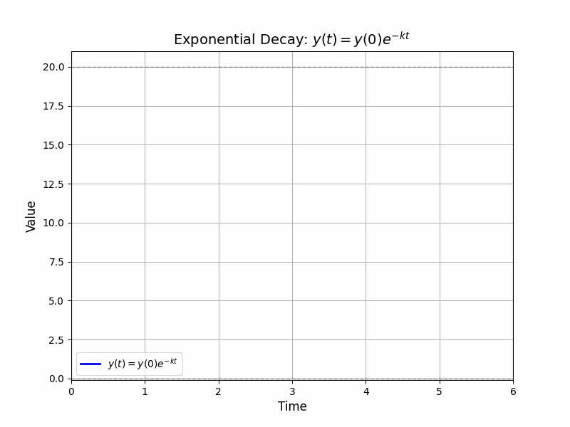

# Control Barrier Function

Finished 
{: .label .label-red }

Consider a contol-affine dynamical system defined as:

$$
\dot{\mathbf{x}} = f(\mathbf{x}) + g(\mathbf{x})u
$$

where $$\mathbf{x}\in\mathcal{X}\sub\mathbb{R}^{d}$$, $$\mathbf{u}\in\mathcal{U}\sub\mathbb{R}^{q}$$ denotes the control input. 
$$f:\mathbb{R}^{d} \mapsto \mathbb{R}^{d}$$ and $$g\!:\!\mathbb{R}^{d}\!\mapsto\!\mathbb{R}^{d\times q}$$ are locally Lipschitz continuous.


## Theorem 
(Safety) Considering the safety radius $$R_\mathrm{s}\in\mathbb{R}$$, if we want to ensure that the robots $$i$$ and $$j$$ are not collide with each other, we can define such set as:

$$
h^\mathrm{s}_{i,j}(\mathbf{x}) = ||\mathbf{x}_i -\mathbf{x}_j||^2 -R_\mathrm{s}^2, \forall i>j\\
\mathcal{H}^\mathrm{s}_{i,j} = \{\mathbf{x} \in \mathbb{R}^{dN} | h^\mathrm{s}_{i,j}(\mathbf{x}) \geq 0 \}
$$


Then, we have the following theorem:

**Theorem 1 (Control Barrier Function):** Given a deterministic dynamical system affine in control (i.e., $$\dot{\mathbf{x}}=F(\mathbf{x})+G(\mathbf{x})\mathbf{u}$$) and a desired set $$\mathcal{H}$$ as the 0-super level set of 
a continuously differentiable function $$h: \mathcal{X} \mapsto \mathbb{R}$$, 
the function $h$ is called a control barrier function, if there exists an extended class-$$\mathcal{K}$$ function $$\kappa(\cdot)$$ such that 


$$
\sup_{\mathbf{u}\in\mathcal{U}}\{\dot{h}(\mathbf{x}, \mathbf{u})\}\geq -\kappa(h(\mathbf{x}))
$$

for all $$\mathbf{x}\in\mathcal{X}$$
. 


## Question 1 why this cosntraint can enfore the forward invariance of the set $$\mathcal{H}$$?

Let's make it formal! We can define the problem as:

**Problem 1:** Given the initial time step $$t = 0$$ , $$h(\mathbf{x}(0))\geq0$$ and $$\dot{h}(\mathbf{x})\geq-\alpha(h(\mathbf{x}))$$ holds 
for all $$t\geq0$$, then $$h(\mathbf{x}(t))\geq0$$ for all $$t\geq0$$.

First, let's define an auxiliary function as:

$$
\frac{d}{dt}y(t) = -\alpha(y(t)), \quad y(0) = h(x(0))
$$

An example for such function is that $$y(t) = e^{-\alpha t}y(0)$$. This equation describes an independent system where the rate of the change of $$y(t)$$ is proportional to the value of $$y(t)$$ itself. 
```julia
import numpy as np
import matplotlib.pyplot as plt

k = 1.0
h0 = 10
h1 = 20
h2 = 30
t = np.linspace(0, 30, 1000)


def y(t, h0, k):
    return h0 * np.exp(-k * t)

y_t = y(t, h0, k)
y_t1 = y(t, h1, k)
y_t2 = y(t, h2, k)
plt.figure(figsize=(8, 6))

plt.plot(t, y_t, 'r', label='y(t) = 10 * exp(-kt)', linewidth = 2)
plt.plot(t, y_t1, 'g', label='y(t) = 20 * exp(-kt)', linewidth = 2)
plt.plot(t, y_t2, 'b', label='y(t) = 30 * exp(-kt)', linewidth = 2)

plt.scatter(0, h0, color='pink', label='10', s=100)
plt.scatter(0, h1, color='black', label='20', s=100)
plt.scatter(0, h2, color='blue', label='30', s=100)

plt.text(0, h0 + 0.05, f'Initial Value: {h0}', color='red', fontsize=10)
plt.text(0, h1 + 0.05, f'Initial Value: {h1}', color='red', fontsize=10)
plt.text(0, h2 + 0.05, f'Initial Value: {h2}', color='red', fontsize=10)

# Plot settings
plt.title('Exponential Decay: $y(t) = y(0) e^{-kt}$', fontsize=14)
plt.xlabel('Time', fontsize=12)
plt.ylabel('Value', fontsize=12)
plt.axhline(0, color='black', linewidth=1, linestyle='--')
plt.axhline(h0, color='grey', linewidth=1, linestyle='--')
plt.axhline(0, color='grey', linewidth=1, linestyle='--')
plt.grid(True)
plt.legend()
plt.show()
```
<div align="center">


</div>

[See implementation for Gif](../../../code/cbf.html)

Then, we can get the following equation:
**Definition 1 (Class-$$\mathcal{K}$$ funciton):**
The Class $$\mathcal{K}$$ function is a function $$\alpha: \mathbb{R}_{\geq 0} \mapsto \mathbb{R}_{\geq 0}$$ that is continuous, strictly increasing, and $$\alpha(0) = 0$$. 

Since $$\alpha$$ is a class-$$\mathcal{K}$$ function, we can get the $$\alpha(h)$$ is **monotonically increasing** with $$\alpha (0) = 0 $$, we can intituively know that $$y(t)$$ will remain non-negaitve. When the
$$y(t)\rightarrow0$$, the decrease rate of $$y(t)$$s, (i.e., $$\frac{d}{dt}y(t)\rightarrow 0$$) will approach to zero. 

Therefore, if we can get if the change rate of $$h(\mathbf{x}(t))$$ is always larger than the change rate of $$y(t)$$, we can ensure that $$h(\mathbf{x}(t))\geq0$$ for all $$t\geq0$$.
That means the decrease speed is lower than the decrease speed of $$y(t)$$. With this, we can get easily conclude the conclusion.


love