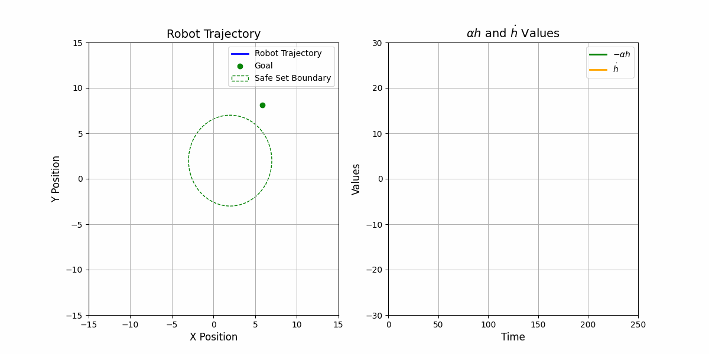

# Control Barrier Function with Basic Example

Finished :sunglasses:
{: .label .label-red}

Here Let's consider a simple example to illustrate the concept of Control Barrier Function.

## Sytem Dynamics

Consider a simple system dynamics as:

\begin{equation}
\dot{\mathbf{x}} = \mathbf{u}
\end{equation}

where $$x\in\mathbb{R}^2$$ and $$u\in\mathbb{R}^2$$ denotes the control input.

## Safety Set

Then we define the safe set $$\mathcal{H}$$ as: 

\begin{equation}
h(\mathbf{x}) = 5- || \mathbf{x} || \geq 0
\end{equation}

$$
\mathcal{H} = \{ \mathbf{x}\in\mathbb{R}^2 | h(\mathbf{x}) \geq 0 \} \tag{3}
$$

By defining the safety set, we can ensure that the robot is always at most 5 units away from the origin.

## Control Barrier Function

Following the definition of Control Barrier Function (refer to [Theorem Control Barrier Function](Control_Barrier_Function.html#theorem-1)), we can define such constraints as:

\begin{equation}
\dot{h}(\mathbf{x}, \mathbf{u}) = \nabla h(\mathbf{x}) \cdot \mathbf{u} \geq -\kappa(h(\mathbf{x}))
\end{equation}

where $$\kappa(h(\mathbf{x}))$$ is an extended class-$$\mathcal{K}$$ function.

## Example

First lets use a move-to-goal controller as:

\begin{equation}
\mathbf{u}^\mathrm{ref} = -k(\mathbf{x} - \mathbf{x}^\mathrm{goal})
\end{equation}

Then to ensure the system state is _**safe**_ , we can use the following Quadratic Program (QP) to solve for the control input:

$$
\mathbf{u}^{*} = \arg\min_{\mathbf{u}} \frac{1}{2}||\mathbf{u} - \mathbf{u}^\mathrm{ref}||^2 \quad \\
\text{s.t.} \quad \nabla h(\mathbf{x}) \cdot \mathbf{u} \geq -\kappa(h(\mathbf{x}))
$$

This can be solved using any QP solver. Here is the results:

This is cool :hugs: Right? It is very easy to develop with theorectical guarantee.