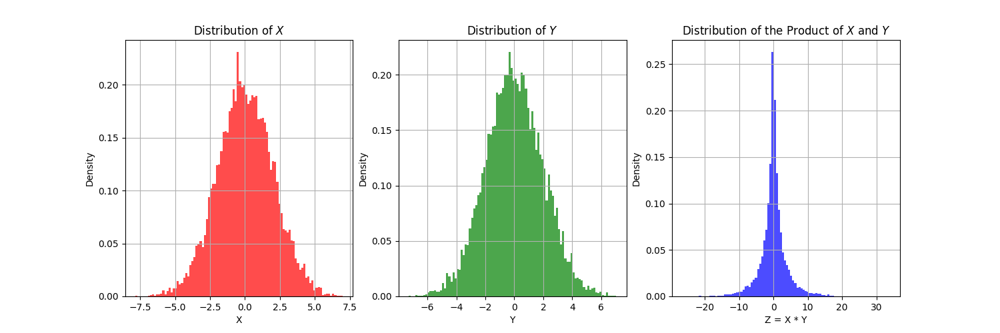
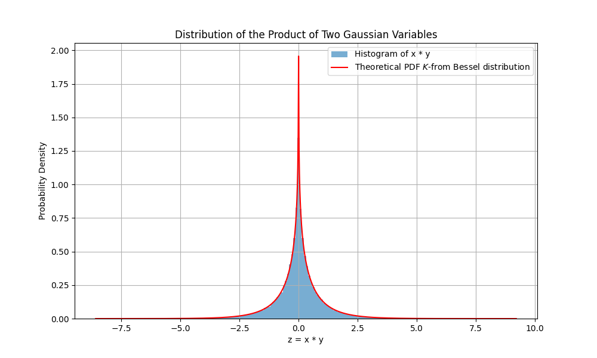

#  Two Gaussian Multiplication

Working on it! :construction:
{: .label .label-blue }

## Gaussian Distribution Preliminaries

The Gaussian distribution material can be easily found in many textbooks. Here we directly
define the random variable $$x$$ and $$y$$ as:

$$
x \sim \mathcal{N}(\mu_x, \Sigma_x)  \tag{1} 
$$

$$
y \sim \mathcal{N}(\mu_y, \Sigma_y)  \tag{2}
$$

where $$\mu_x$$ and $$\mu_y$$ are the mean of the Gaussian distribution, 
and $$\Sigma_x$$ and $$\Sigma_y$$ are the covariance matrix of the
Gaussian distribution.


Here we are interested in the distribution of the random variable $$z$$, which is the multiplication of $$x$$ and $$y$$:

$$
z =xy   \tag{3}
$$

## Question 1: What is the distribution of the random variable $$z$$?

Let's play with the example to visualize the distribution of the random variable $$z$$.

<div align="center">

</div>

It looks like a Gaussian distribution, right? But is this true? :thinking:

Let's dig into the details! :mag_right:

First, we can use an relative easy way as described in this [link](https://math.stackexchange.com/questions/101062/is-the-product-of-two-gaussian-random-variables-also-a-gaussian):

The basic idea is that:

$$
(x+y)^2 = x^2 + 2xy + y^2
$$

$$
(x-y)^2 = x^2 - 2xy + y^2
$$

So 

$$
xy = \frac{1}{4}[(x+y)^2 - (x-y)^2]
$$

$$  
xy \sim \frac{\mathrm{Var}(x+y)}{4} \mathcal{Q} +
 \frac{\mathrm{Var}(x-y)}{4} \mathcal{R} 
$$

where $$\mathcal{Q}$$ and $$\mathcal{R}$$ are central chi-square distribution.
So the distribution of $$z$$ is a **_linear_** combination of two central chi-square distribution.

To make it more formal, we should use the **_characteristic_** function to derive the distribution of $$z$$. :nerd_face:

Actually, we can get that:

$$
f_z(z) = \frac{1}{\pi} K_0(|z|) \quad\quad |z| >0
$$

where $$K_0$$ is the modified Bessel function of the second kind of order 0. 
It shows that the distribution of the random variable $$z$$ is a k-form **_Bessel_** distribution. :sunglasses

Let's visualize :chart_with_upwards_trend: this process!

<div align="center">

</div>

```julia
import numpy as np
import matplotlib.pyplot as plt
from scipy.special import kv ## Bessel function
from scipy.stats import norm

Sample = 1000
mu_x = 0
mu_y = 0
sigma_x = 1
sigma_y = 1

## Gaussian Distribution

x = np.random.normal(mu_x, sigma_x, Sample)
y = np.random.normal(mu_y, sigma_y, Sample)

## Product of two Gaussian Distribution

z = x * y

## Theoretical Distribution
def pdf_z(z):
    return (1 / (np.pi * sigma_x * sigma_y)) * kv(0, np.abs(z) / (sigma_x * sigma_y))

z_v = np.linspace(np.min(z), np.max(z), 10000)
pdf_z = pdf_z(z_v)

# Plot 
plt.figure(figsize=(10, 6))
plt.hist(z, bins=200, density=True, alpha=0.6, label='Histogram of x * y')
plt.plot(z_v, pdf_z, 'r', label='Theoretical PDF $K$-from Bessel distribution')

plt.xlabel('z = x * y')
plt.ylabel('Probability Density')
plt.title('Distribution of the Product of Two Gaussian Variables')
plt.legend()
plt.grid(True)
plt.show()
```

Thats it! :tada: 
This property may be very useful in future work! :rocket: